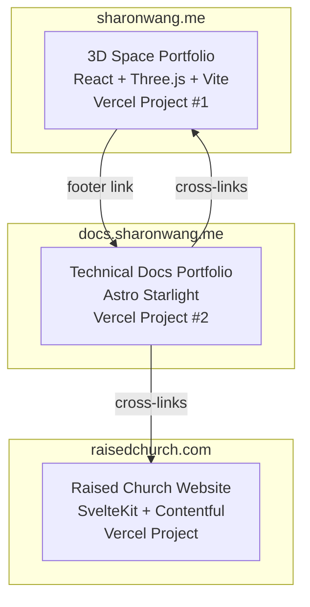

# docs.sharonwang.me — Technical Communication Portfolio

A standalone documentation site positioning Sharon Wang as a versatile technical communicator — someone with deep SWE skills who can also write for developers, AI agents, non-technical stakeholders, and research audiences. Built with Astro Starlight, deployed to `docs.sharonwang.me` via Vercel.

**Target roles**: Technical Writer · Technical Support Engineer · Technical Program Manager

---

## Pre-Implementation Checklist

- [ ] **DNS**: Add CNAME record `docs.sharonwang.me` → `cname.vercel-dns.com` in DNS provider
- [ ] **LinkedIn handle**: Update social link in `astro.config.mjs` with actual LinkedIn URL
- [ ] **Word doc ready**: Have the CATME/TeamAssign Word document ready for anonymization
- [ ] **Textual criticism paper**: Have the Word document ready for MDX conversion

---

## Architecture Overview



### Separate Repo Rationale

| Concern | Decision |
|---|---|
| **Build isolation** | Vite+Three.js and Astro have different pipelines — no CI coupling |
| **Independent deploys** | Fix a docs typo without rebuilding the 3D portfolio |
| **Clean deps** | No mixing R3F with Astro/Starlight |
| **Recruiter signal** | A dedicated docs repo signals intentional documentation practice — exactly what a TW/TPM hiring manager wants to see |

---

## Project Structure

```
docs/
├── astro.config.mjs              # Starlight config (sidebar, site metadata)
├── package.json
├── tsconfig.json
├── vercel.json                    # Vercel deployment config
├── public/
│   ├── favicon.svg
│   └── og-image.png              # Social media preview image
└── src/
    ├── assets/                    # Logos, diagrams, screenshots
    ├── content/
    │   └── docs/                  # All documentation pages
    │       ├── index.mdx                          # Landing page
    │       ├── about.mdx                          # About / philosophy
    │       ├── 3d-space-portfolio/                 # Portfolio docs (7 pages)
    │       ├── teamassign/                         # Anonymized CATME docs (5 pages)
    │       ├── raised-church-website/              # Svelte+Contentful docs (6 pages)
    │       └── articles/                           # Standalone writing
    ├── components/                # Custom MDX components (optional)
    └── styles/
        └── custom.css             # Theme overrides
```

---

## Content Architecture

### Competency Map

The site is deliberately organized to demonstrate range across the core competencies hiring managers look for:

| Competency | Demonstrated by |
|---|---|
| **Developer documentation** | 3D Portfolio docs (API ref, architecture, testing) |
| **Legacy system onboarding** | TeamAssign docs (getting-started guide for a complex Perl system) |
| **Multi-audience writing** | Raised Church docs (same project → 3 completely different audiences) |
| **User-facing documentation** | Content Editor Guide (step-by-step for non-technical church staff) |
| **AI/automation documentation** | AI Agent Guide (structured instructions for LLM consumption) |
| **Long-form technical writing** | Textual criticism article (academic prose, structure, argumentation) |
| **Troubleshooting & support** | TeamAssign troubleshooting guide (runbook-style diagnostics) |

---

### Section 1: 3D Space Portfolio

Source: Adapted from existing `3d-space-portfolio/docs/` + new pages.
Cross-links to: [sharonwang.me](https://sharonwang.me) (live site) + [GitHub repo](https://github.com/sharonwang554/3d-space-portfolio)

| Page | Content | Source |
|---|---|---|
| **Overview** | Project intro, hero with "View Live Site →" and "View Source" buttons, tech stack summary | New |
| **Architecture** | Project structure, data flow, component organization, Mermaid diagrams | Adapted from `project-structure.md` |
| **3D Graphics** | Three.js/R3F approach, custom shaders, performance optimization, mobile considerations | New (drawn from Earth/SpaceBackground components) |
| **Styling System** | SCSS Modules, BEM, design tokens, `:global()` rules, migration checklist | Adapted from `scss-module-standards.md` |
| **Internationalization** | i18n approach, LanguageContext, translation workflow, browser detection | New (drawn from LanguageContext + sectionTranslations) |
| **Testing Strategy** | Vitest setup, coverage thresholds, CI integration, test patterns | Adapted from `testing.md` |
| **API Reference** | Component props, hooks, stores, CSS custom properties, build config | Adapted from `api-reference.md` |

---

### Section 2: TeamAssign (Anonymized CATME Docs)

Source: Anonymized from existing Word document. Original system is a **Perl-based web application for academic team management** — team formation, peer evaluation, survey administration — used by thousands of instructors across hundreds of institutions since 2005.

**Anonymization approach:**
- Project name → "TeamAssign"
- University name → "a major research university"
- Specific instructor/student names → removed
- Internal URLs/hostnames → genericized
- Core architecture and technical patterns → preserved (these are the valuable part)

| Page | Content | Writing skill demonstrated |
|---|---|---|
| **Overview** | System purpose (academic team management platform), Perl tech stack, scale (hundreds of institutions, 15+ years), why this documentation exists | Context-setting, system-level thinking |
| **Getting Started** | Dev environment setup, Perl dependencies, database configuration, first local run | Onboarding documentation |
| **Architecture** | System design: Perl CGI/mod_perl architecture, database schema patterns, module organization, data flow for team formation and peer evaluation workflows | Technical architecture writing |
| **Developer Tips** | Common Perl patterns in the codebase, gotchas, debugging techniques, coding conventions, regex patterns | Tribal knowledge capture |
| **Troubleshooting** | Common errors, symptom → diagnosis → fix format, database issues, deployment problems | Support/runbook writing |

> This section is particularly strong for **Technical Support Engineer** roles — it demonstrates the ability to create troubleshooting guides and capture institutional knowledge from a complex, long-running legacy system. The Perl stack also shows comfort with older technologies that many TSE roles encounter.

---

### Section 3: Raised Church Website (左營復活堂)

Source: Existing docs for the SvelteKit + Contentful project.
Cross-links to: [raisedchurch.com](https://raisedchurch.com) (live site, currently at [Vercel preview](https://raised-church-website-kappa.vercel.app/))

This is a **bilingual (Chinese/English) church website** serving 左營復活堂 (Raised Church) in Kaohsiung, Taiwan. Built with SvelteKit and Contentful CMS so non-technical church staff can manage content (sermons, events, gathering times) without developer help.

This section is the strongest showcase piece because it demonstrates **writing for 3 completely different audiences** from the same project:

| Page | Target audience | Writing skill demonstrated |
|---|---|---|
| **Overview** | Everyone | Project scoping, stakeholder communication, live site link |
| **Architecture** | Developers | SvelteKit + Contentful integration, component design, data flow from CMS to rendered pages |
| **AI Agent Guide** | LLM/AI agents | Structured instructions for AI-assisted development — demonstrates awareness of emerging documentation paradigms |
| **Developer Guide** | Future developers | Codebase onboarding, SvelteKit conventions, component patterns, contribution workflow |
| **Content Editor Guide** | Non-technical church staff | Step-by-step Contentful editing with annotated screenshots, no jargon — "How to add a new sermon," "How to update gathering times," etc. |
| **Deployment** | DevOps / developers | SvelteKit build pipeline, Vercel hosting, Contentful webhooks, environment configuration |

> The **Content Editor Guide** is a standout piece for Technical Writer roles — it demonstrates translating a CMS into clear, accessible instructions for non-technical users who update content weekly. The **AI Agent Guide** is forward-looking and unusual — it signals awareness of how documentation is evolving with LLMs.

---

### Section 4: Articles

| Page | Content |
|---|---|
| **Textual Criticism** | Long-form academic paper (converted from Word → MDX) demonstrating structured argumentation, scholarly methodology, citations, and polished English prose |

This section uses Starlight's `autogenerate` — future articles are added by simply dropping `.mdx` files into the `articles/` directory. No config changes needed.

**Future article ideas** (optional):
- Architecture Decision Records (ADRs) from any project
- Technical deep-dives (e.g., "How I optimized Three.js for mobile")
- Process documentation (e.g., "How I set up CI/CD for a SvelteKit + Contentful project")

---

### Landing Page & About

| Page | Purpose |
|---|---|
| **Landing page** (`index.mdx`) | Brief intro: "I'm Sharon Wang — a software engineer who writes." Card-style links to each section with 1-line descriptions and audience badges. Immediately communicates range. |
| **About** (`about.mdx`) | Documentation philosophy, approach to audience analysis, tools used (Starlight, MDX, Mermaid, Contentful), link back to portfolio. Positioned as a "cover letter" for documentation-adjacent roles. |

---

## Starlight Configuration

### `astro.config.mjs`

```js
import { defineConfig } from 'astro/config';
import starlight from '@astrojs/starlight';
import vercel from '@astrojs/vercel';

export default defineConfig({
  site: 'https://docs.sharonwang.me',
  adapter: vercel({ imageService: true }),
  integrations: [
    starlight({
      title: 'Sharon Wang',
      tagline: 'Technical Documentation Portfolio',
      social: [
        { icon: 'github', label: 'GitHub', href: 'https://github.com/sharonwang554' },
        { icon: 'linkedin', label: 'LinkedIn', href: 'https://linkedin.com/in/YOUR_HANDLE' },
        { icon: 'external', label: 'Portfolio', href: 'https://sharonwang.me' },
      ],
      customCss: ['./src/styles/custom.css'],

      // English only for now; structured for future i18n
      defaultLocale: 'en',
      locales: {
        en: { label: 'English', lang: 'en' },
        // Future: zh: { label: '繁體中文', lang: 'zh-TW' },
      },

      sidebar: [
        {
          label: '3D Space Portfolio',
          badge: { text: 'Live', variant: 'success' },
          items: [
            { label: 'Overview', slug: '3d-space-portfolio/overview' },
            { label: 'Architecture', slug: '3d-space-portfolio/architecture' },
            { label: '3D Graphics', slug: '3d-space-portfolio/3d-graphics' },
            { label: 'Styling System', slug: '3d-space-portfolio/styling-system' },
            { label: 'Internationalization', slug: '3d-space-portfolio/internationalization' },
            { label: 'Testing Strategy', slug: '3d-space-portfolio/testing-strategy' },
            { label: 'API Reference', slug: '3d-space-portfolio/api-reference' },
          ],
        },
        {
          label: 'TeamAssign',
          badge: { text: 'Legacy', variant: 'note' },
          items: [
            { label: 'Overview', slug: 'teamassign/overview' },
            { label: 'Getting Started', slug: 'teamassign/getting-started' },
            { label: 'Architecture', slug: 'teamassign/architecture' },
            { label: 'Developer Tips', slug: 'teamassign/developer-tips' },
            { label: 'Troubleshooting', slug: 'teamassign/troubleshooting' },
          ],
        },
        {
          label: 'Raised Church Website',
          badge: { text: 'Live', variant: 'success' },
          items: [
            { label: 'Overview', slug: 'raised-church-website/overview' },
            { label: 'Architecture', slug: 'raised-church-website/architecture' },
            { label: 'AI Agent Guide', slug: 'raised-church-website/ai-agent-guide' },
            { label: 'Developer Guide', slug: 'raised-church-website/developer-guide' },
            { label: 'Content Editor Guide', slug: 'raised-church-website/content-editor-guide' },
            { label: 'Deployment', slug: 'raised-church-website/deployment' },
          ],
        },
        {
          label: 'Articles',
          autogenerate: { directory: 'articles' },
        },
        {
          label: 'About',
          slug: 'about',
        },
      ],

      editLink: {
        baseUrl: 'https://github.com/sharonwang554/docs/edit/main/',
      },

      head: [
        // Vercel Analytics
        {
          tag: 'script',
          attrs: { defer: true, src: '/_vercel/insights/script.js' },
        },
      ],
    }),
  ],
});
```

---

## Branding & Styling

### Design Direction: Clean Professional

The docs site should feel like **Stripe's docs** or **Cloudflare's developer docs** — authoritative, clean, and polished.

| Aspect | Decision | Rationale |
|---|---|---|
| **Color palette** | Indigo/violet accent on Starlight defaults | Clean, professional, gender-neutral |
| **Typography** | Inter (body) via `@fontsource/inter` — matches portfolio | Consistency across properties |
| **Logo** | Text-only: "Sharon Wang" | Simple, name-forward — this is a personal brand |
| **Favicon** | Derive from portfolio or use a simple monogram | Visual consistency |
| **Dark/Light mode** | Starlight built-in toggle (defaults to system preference) | Expected by technical audiences |
| **Code blocks** | Starlight's built-in Shiki syntax highlighting | Supports all languages including Perl, Svelte, TypeScript |

### `src/styles/custom.css`

```css
@import url('https://fonts.googleapis.com/css2?family=Inter:wght@400;500;600;700&display=swap');

:root {
  --sl-font: 'Inter', -apple-system, BlinkMacSystemFont, 'Segoe UI', sans-serif;
  --sl-color-accent-low: #e0e7ff;
  --sl-color-accent: #6366f1;
  --sl-color-accent-high: #312e81;
}

:root[data-theme='dark'] {
  --sl-color-accent-low: #1e1b4b;
  --sl-color-accent: #818cf8;
  --sl-color-accent-high: #e0e7ff;
}
```

---

## Deployment

### `vercel.json`

```json
{
  "buildCommand": "bun install && bun run build",
  "outputDirectory": "dist",
  "headers": [
    {
      "source": "/(.*)",
      "headers": [
        { "key": "X-Content-Type-Options", "value": "nosniff" },
        { "key": "X-Frame-Options", "value": "DENY" }
      ]
    }
  ]
}
```

### DNS Setup (Manual)
```
docs.sharonwang.me  CNAME  cname.vercel-dns.com
```

---

## Extensibility

| Action | Steps required |
|---|---|
| **Add a new article** | Drop `.mdx` into `src/content/docs/articles/` — auto-appears via `autogenerate` |
| **Add a new project section** | Create directory + MDX files, add one sidebar group in `astro.config.mjs` |
| **Add Chinese i18n** | Uncomment `zh` locale, create `src/content/docs/zh/` mirror |
| **Add a standalone page** | Drop `.mdx` anywhere in `src/content/docs/`, add to sidebar |

---

## Cross-Linking Strategy

| From | To | How |
|---|---|---|
| Docs site header | Portfolio | Persistent "Portfolio ↗" social link in Starlight nav |
| Docs site header | GitHub | Persistent GitHub social link |
| Portfolio overview page | Live site | Hero banner with "View Live Site →" button |
| Portfolio overview page | GitHub | Hero banner with "View Source" button |
| Raised Church overview | Live site | Hero banner linking to `raisedchurch.com` |
| Portfolio site (optional) | Docs site | Footer link: "📄 Technical Docs → docs.sharonwang.me" |

---

## Implementation Phases

### Phase 1: Scaffolding & Config (Day 1)
- [ ] Create `sharonwang554/docs` GitHub repo
- [ ] Scaffold Astro Starlight project
- [ ] Configure `astro.config.mjs` (sidebar, metadata, social links)
- [ ] Set up `custom.css` (typography, accent colors)
- [ ] Configure Vercel project + `docs.sharonwang.me` domain + DNS CNAME
- [ ] Verify clean build + local dev server

### Phase 2: 3D Portfolio Docs (Day 1–2)
- [ ] Migrate + enhance 4 existing docs (architecture, API ref, styling, testing)
- [ ] Write 3 new pages (overview with hero, 3D graphics, internationalization)
- [ ] Add cross-links to live site and GitHub source

### Phase 3: Raised Church Website Docs (Day 2–3)
- [ ] Write overview + architecture pages (SvelteKit + Contentful)
- [ ] Write AI Agent Guide
- [ ] Write Developer Guide
- [ ] Write Content Editor Guide (with annotated screenshots for Contentful workflows)
- [ ] Write Deployment page

### Phase 4: TeamAssign Docs (Day 3–4)
- [ ] Anonymize Word document content (names, URLs, institution references)
- [ ] Split into: overview, getting started, architecture, developer tips, troubleshooting
- [ ] Adapt formatting from Word → MDX with Perl code blocks and Mermaid diagrams
- [ ] Review for any remaining identifying information

### Phase 5: Articles, About & Polish (Day 4–5)
- [ ] Convert textual criticism paper from Word → MDX
- [ ] Write landing page (`index.mdx`) with card-style section links
- [ ] Write About page (documentation philosophy, audience analysis approach)
- [ ] Full review: consistency, SEO meta, sidebar ordering, cross-links
- [ ] Lighthouse audit
- [ ] Optional: add "Technical Docs" link on portfolio site footer

---

## Verification Plan

### Automated
```bash
bun run build              # Clean Astro build, no errors
bunx astro check           # TypeScript + content collection validation
```

### Manual Verification
- [ ] All sidebar links resolve — no 404s
- [ ] Built-in Pagefind search indexes all pages correctly
- [ ] Dark/light mode toggle works on all pages
- [ ] Mobile responsive layout (test at 375px, 768px, 1440px)
- [ ] Cross-links to `sharonwang.me` and `raisedchurch.com` work
- [ ] `docs.sharonwang.me` resolves via DNS and serves the site
- [ ] "Edit this page" GitHub links point to correct source files
- [ ] Lighthouse: Performance 95+, Accessibility 100, SEO 100
- [ ] OG image renders correctly when shared on LinkedIn/Slack
- [ ] TeamAssign section contains no identifying information (university, product name, personnel)
