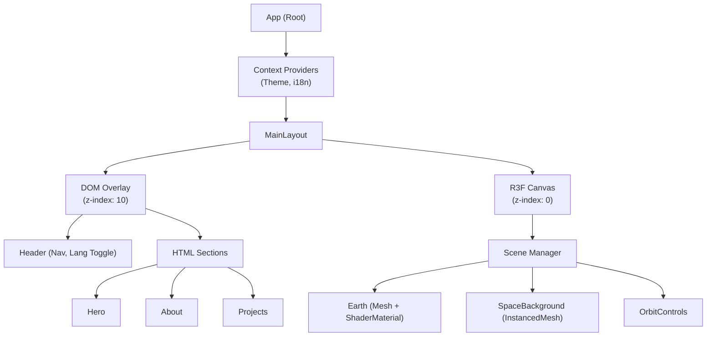
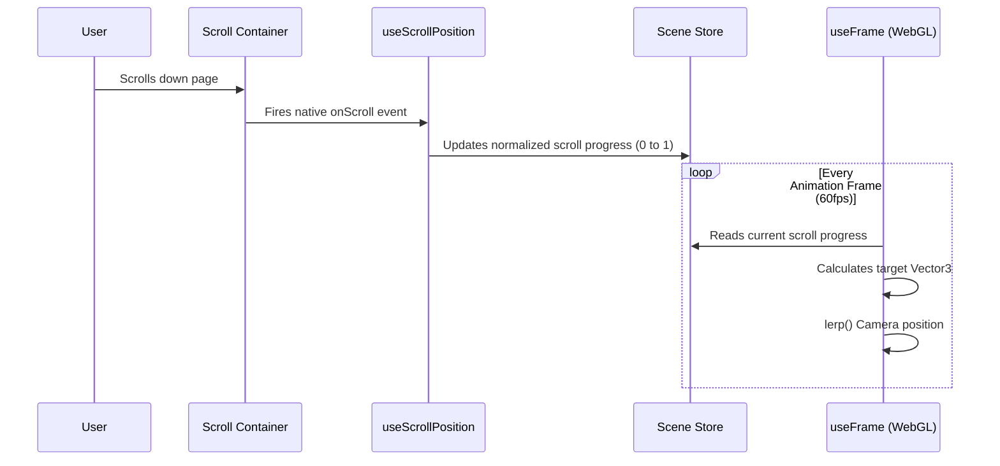

import { Steps, Aside, Tabs, TabItem } from '@astrojs/starlight/components';

The 3D Space Portfolio utilizes a hybrid architecture, orchestrating both a standard DOM tree for accessible UI and a WebGL canvas for the interactive 3D environment. This document outlines the project structure, component hierarchy, and the flow of data.

## Directory Structure

The project follows a feature-based organization strategy.

```text
3d-space-portfolio/
├── public/                 # Static assets (textures, models, locales)
├── src/
│   ├── assets/             # Bundled assets (SCSS variables, SVGs)
│   ├── components/         # Reusable React components
│   │   ├── 3d/             # React Three Fiber components (Earth, Stars)
│   │   ├── ui/             # Standard DOM components (Buttons, Cards)
│   │   └── layout/         # Structural components (Header, Footer)
│   ├── context/            # React Contexts (LanguageContext)
│   ├── hooks/              # Custom React hooks
│   ├── styles/             # Global SCSS and mixins
│   ├── utils/              # Helper functions and constants
│   ├── App.tsx             # Root application component
│   └── main.tsx            # Entry point and provider wrapping
├── tests/                  # Vitest configuration and global mocks
├── index.html              # HTML template
├── vite.config.ts          # Vite bundler configuration
└── package.json
```

## Component Hierarchy

The application strictly separates the HTML/DOM overlay layer from the WebGL `<Canvas>` layer to ensure performance and prevent unnecessary re-renders of the 3D scene.



## State Management Approach

State is managed locally where possible, and elevated to React Context only when data needs to be accessed globally across the application tree.

### 1. Global Application State (React Context)
We use React Context primarily for the **Internationalization (i18n)** layer and **Theme preferences**. These values change infrequently but are required by nearly every component in the DOM overlay.

<Aside type="note">
  By keeping the Context scoped to infrequent updates (like language toggle), we avoid the "Context Hell" performance penalty where the entire app re-renders on every state change.
</Aside>

### 2. 3D Interaction State (Zustand-style)
For the 3D scene, passing state through React props can become a bottleneck. The project utilizes a lightweight store pattern for managing camera positions, current active section, and scroll progress.

<Tabs>
  <TabItem label="Store Pattern" icon="seti:typescript">
    ```typescript
    // store/useSceneStore.ts
    import { create } from 'zustand'
    
    interface SceneState {
      targetSection: string;
      cameraPosition: [number, number, number];
      setTargetSection: (section: string) => void;
    }
    
    export const useSceneStore = create<SceneState>((set) => ({
      targetSection: 'hero',
      cameraPosition: [0, 0, 5],
      setTargetSection: (section) => set({ targetSection: section }),
    }))
    ```
  </TabItem>
  <TabItem label="Component Usage" icon="seti:react">
    ```tsx
    // components/3d/CameraRig.tsx
    import { useFrame } from '@react-three/fiber'
    import { useSceneStore } from '../../store/useSceneStore'
    
    export function CameraRig() {
      // Subscribes only to targetSection
      const target = useSceneStore((state) => state.targetSection)
      
      useFrame((state) => {
        // Smoothly interpolate camera based on target
      })
      return null
    }
    ```
  </TabItem>
</Tabs>

## Data Flow: Scroll and Navigation

The core mechanic of the portfolio involves syncing the user's DOM scroll position with the 3D camera in the WebGL context.



## Build Pipeline

The project utilizes Vite for an optimized build process.

<Steps>
1. **TypeScript Compilation**: Esbuild strips TypeScript annotations and transpiles JSX incredibly fast.
2. **Asset Optimization**: Textures (`.jpg`, `.png`) are processed. Small assets are inlined as Base64, while larger 3D models and high-res textures are hashed and output as separate files.
3. **CSS Extraction**: SCSS Modules are compiled into optimized, minified CSS files.
4. **Chunking**: Vendor libraries (like `three` and `@react-three/fiber`) are split into separate chunks to optimize browser caching strategies.
</Steps>
