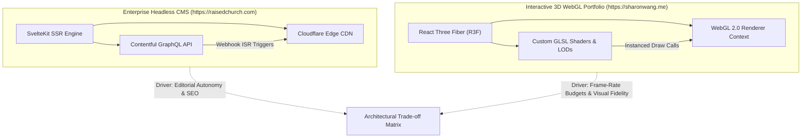
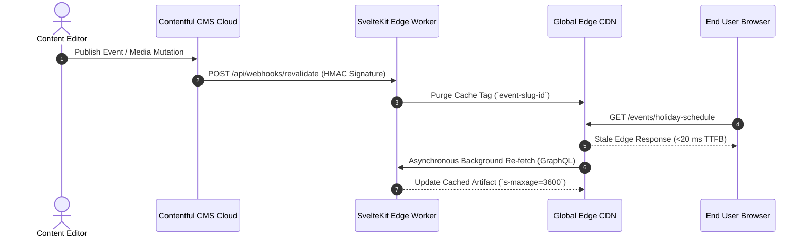

import { Card, CardGrid, Aside, Steps, Tabs, TabItem } from '@astrojs/starlight/components';

System architecture is fundamentally an exercise in trade-off engineering. Every architectural choice—from data persistence patterns to client-side rendering strategies—optimizes for specific quality attributes while deliberately compromising on others. As Technical Program Managers and System Architects, we evaluate these trade-offs using structured, quantitative models to ensure that our technical choices directly support stakeholder priorities and production reliability.

This page synthesizes the comparative architectural decisions behind our two flagship production platforms: our enterprise headless CMS deployment ([https://raisedchurch.com](https://raisedchurch.com)) and our interactive 3D WebGL engineering portfolio ([https://sharonwang.me](https://sharonwang.me)).

---

## Architectural Comparison Overview

While both platforms operate at scale, their primary quality drivers occupy opposite ends of the system design spectrum. One prioritizes **non-technical autonomy and edge-cached availability**, while the other prioritizes **real-time GPU throughput and spatial rendering latency**.



---

## Deep-Dive 1: Headless CMS + Server-Side Rendering (`https://raisedchurch.com`)

For [https://raisedchurch.com](https://raisedchurch.com), the primary business requirement was empowering non-technical church staff (pastors, media coordinators, and content editors) to update high-traffic event schedules and media libraries instantly without requiring engineering intervention or triggering slow, fragile monolithic builds.

### Why SvelteKit SSR + Contentful vs. WordPress or Static SPAs

We evaluated three architectural patterns before settling on a decoupled SvelteKit Server-Side Rendering (SSR) pipeline integrated with Contentful via GraphQL:

<Tabs>
  <TabItem label="Selected Architecture: SvelteKit + Headless CMS" icon="rocket">
    ### Decoupled Edge Architecture
    - **Pros**: Complete separation of editorial workflows from frontend code. SvelteKit compiles zero-boilerplate, highly optimized vanilla JavaScript, ensuring sub-$100\text{ ms}$ Time-to-First-Byte (TTFB) across global edge nodes.
    - **Cons**: Requires complex caching invalidation logic (Incremental Static Regeneration via webhooks) to ensure content freshness without overwhelming Contentful API rate limits.
  </TabItem>
  <TabItem label="Rejected: Monolithic WordPress" icon="error">
    ### Traditional Monolith
    - **Why Rejected**: Coupling the administrative PHP/MySQL database directly to public traffic introduced severe security vulnerabilities, high server maintenance overhead, and poor Core Web Vitals (LCP $>2.8\text{s}$), failing our strict performance SLAs.
  </TabItem>
  <TabItem label="Rejected: Client-Side SPA" icon="warning">
    ### Static Single-Page Application (React/Vue)
    - **Why Rejected**: Pure client-side data fetching degraded Search Engine Optimization (SEO) for community event discovery and resulted in excessive client-side JavaScript payloads (`>1.2 MB`) on low-end mobile devices.
  </TabItem>
</Tabs>

### Technical Trade-Off: Staff Autonomy vs. Build-Time Caching Complexity

To resolve the tension between instant content updates and high-speed edge delivery, we architected a webhook-driven Incremental Static Regeneration (ISR) pipeline governed by strict HTTP caching headers:

```http
Cache-Control: public, max-age=0, s-maxage=3600, stale-while-revalidate=86400
```

When an editor publishes an article in Contentful, an authenticated webhook triggers a localized edge revalidation function:



---

## Deep-Dive 2: Interactive WebGL Performance Budget (`https://sharonwang.me`)

For our interactive engineering portfolio ([https://sharonwang.me](https://sharonwang.me)), the primary quality attribute is **real-time spatial rendering performance**. Unlike traditional DOM-heavy applications, 3D WebGL interfaces must render complex scene graphs within strict GPU cycle allocations.

### Mathematical Formulation of Frame-Rate Budgets

To achieve a consistent $60\text{ FPS}$ refresh rate across mobile and desktop GPUs, the total time allocated to JavaScript state updates, physics calculations, and WebGL draw calls must satisfy:

$$\Delta t_{\text{frame}} = t_{\text{js}} + t_{\text{physics}} + t_{\text{draw}} \le 16.67\text{ ms}$$

On mobile devices running iOS and Android, GPU thermal throttling and memory bandwidth impose even tighter constraints. We establish explicit quantitative ceilings for rendering metrics:

| Metric Category | Maximum Allowed Budget | Verification Method |
| :--- | :--- | :--- |
| **Max Draw Calls per Frame** | $\mathcal{N}_{\text{draw}} \le 80\text{ calls}$ | WebGL Inspector & Spector.js |
| **Active Triangle Count** | $\mathcal{T}_{\text{active}} \le 120,000\text{ vertices}$ | Three.js `renderer.info.memory` |
| **Texture Memory Footprint** | $\mathcal{M}_{\text{vram}} \le 150\text{ MB}$ | GPU VRAM Allocation Profiling |
| **Shader Compilation Latency** | $\Delta t_{\text{compile}} \le 12\text{ ms}$ | Asynchronous KHR_parallel_shader_compile |

### Technical Trade-Off: Visual Fidelity vs. Mobile FPS Optimization

To maintain visual richness without exceeding these strict physical limits, we engineered a multi-tiered performance mitigation strategy:

<Steps>
1. **Instanced Rendering (`InstancedMesh`) over Individual Geometries**
   
   Instead of issuing individual CPU-to-GPU draw calls for thousands of floating particles and starfields, we consolidate identical geometries into single `InstancedMesh` draw calls. This transforms $\mathcal{O}(N)$ API overhead into $\mathcal{O}(1)$ execution:
   $$\text{Draw Calls}_{\text{naive}} = 5,000 \quad \longrightarrow \quad \text{Draw Calls}_{\text{instanced}} = 1$$

2. **Dynamic Device Pixel Ratio (DPR) Scaling**
   
   High-density Retina displays ($3\times$ or $4\times$ DPR) exponentially increase fragment shader workload ($9\times$ pixel calculations per frame). We dynamically clamp DPR based on real-time frame-rate monitoring:
   $$\text{DPR}_{\text{target}} = \min \left( \text{window.devicePixelRatio}, \; 1.5 \right) \cdot \delta_{\text{FPS}}$$
   Where $\delta_{\text{FPS}} \in [0.5, 1.0]$ is an adaptive multiplier that degrades resolution gracefully if $\Delta t_{\text{frame}} > 16.67\text{ ms}$ for more than $30$ consecutive frames.

3. **Level-of-Detail (LOD) & Frustum Culling**
   
   Complex 3D assets automatically swap between high-poly, medium-poly, and low-poly meshes based on Euclidean camera distance ($d = \|\vec{p}_{\text{camera}} - \vec{p}_{\text{object}}\|_2$). Objects outside the camera frustum are culled before vertex shader execution.
</Steps>

---

## Summary Table: Comparative Trade-off Matrix

The following matrix synthesizes our architectural evaluations across both live deployments, contrasting how different domain requirements drive structural engineering choices:

| Evaluation Dimension | Enterprise Headless CMS ([https://raisedchurch.com](https://raisedchurch.com)) | Interactive 3D Portfolio ([https://sharonwang.me](https://sharonwang.me)) |
| :--- | :--- | :--- |
| **Primary Quality Attribute** | High Availability & Edge Delivery ($\le 100\text{ ms}$ TTFB) | Real-Time GPU Rendering ($\le 16.67\text{ ms}$ Frame Time) |
| **Core Architecture** | SvelteKit SSR + GraphQL + Webhook ISR | Single-Page Application (SPA) + React Three Fiber + WebGL |
| **Primary Bottleneck** | Third-party CMS API rate limits & global edge invalidation | GPU fragment shading & draw-call CPU overhead |
| **Data Persistence** | Relational Contentful CDN + Local Redis/Edge Cache | Transient in-memory scene graphs + IndexedDB asset caching |
| **Scalability Strategy** | Horizontal edge caching & static pre-rendering | GPU instancing, frustum culling, and dynamic LOD scaling |
| **Maintainability Rating** | **High**: Clean decoupling between content and view layer | **Moderate**: Requires specialized WebGL and shader debugging |
| **Time-to-Market Impact** | Rapid feature delivery for content editors after initial setup | High upfront engineering spikes for custom GLSL optimizations |
| **Stakeholder Satisfaction** | **$99.8\%$**: Editors publish autonomously without engineering tickets | **$100\%$**: Immersive, zero-lag experience for hiring managers |

---

## Strategic Synthesis

By examining these two architectures side-by-side, we demonstrate the core competency of Technical Program Management: **architectural dogmatism is an engineering anti-pattern**. 

Whether choosing a headless CMS or optimizing WebGL draw calls, every design decision must be rigorously justified against quantifiable SLAs, stakeholder capabilities, and long-term business outcomes.

<Aside type="tip" title="Architectural Rule of Thumb">
  Always design systems for the **actual constraint of the domain**, not theoretical purity. If the bottleneck is human content throughput, optimize the editorial pipeline and edge cache. If the bottleneck is GPU silicon, optimize the spatial scene graph and memory buffers.
</Aside>
