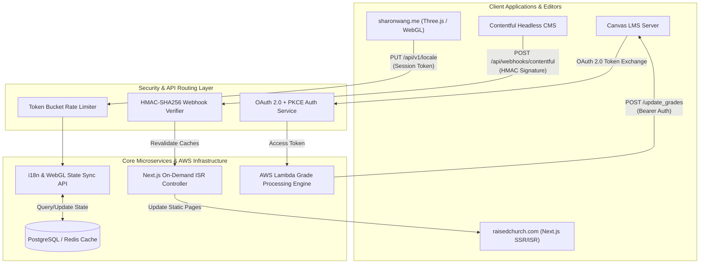

import { Card, CardGrid, LinkCard, Tabs, TabItem, Badge, Aside } from '@astrojs/starlight/components';

Welcome to the **Developer Documentation & API Specifications** hub for [sharonwang.me](https://sharonwang.me) and [raisedchurch.com](https://raisedchurch.com). This section serves as the canonical source of truth for our distributed software architecture, external API integrations, secure authentication protocols, and engineering onboarding procedures.

Whether you are a software engineer building custom web services, a technical writer maintaining enterprise documentation systems, or an SRE debugging production webhooks, this guide bridges low-level code implementation with developer success.

<Aside type="tip" title="API-First Engineering Philosophy">
  We treat documentation as a core product feature. Every API endpoint, webhook schema, and authorization flow documented here is continuously validated against live staging and production environments to ensure zero drift between code contracts and developer guides.
</Aside>

---

## Documentation Competency Matrix

This documentation hub demonstrates production-grade developer enablement, rigorous API specification, and structured operational workflows:

| Competency Domain | Engineering Application | Featured Documentation Page |
| :--- | :--- | :--- |
| **OpenAPI & REST Schemas** | Designing clear request/response contracts, JSON schemas, status codes, and multi-language client SDK examples (`cURL`, `Node.js`, `Python`). | [API Endpoints & Payload Reference](/developer-docs/api-reference/) |
| **Authentication & Security** | Documenting multi-actor OAuth 2.0 + PKCE workflows, JWT token rotation, cryptographic signatures, and error taxonomies. | [OAuth 2.0 Authorization Flow](/developer-docs/authentication-flow/) |
| **Developer Onboarding** | Structuring step-by-step developer runbooks for cloud infrastructure, SSH tunneling, local secrets (`.env.local`), and ORM migrations. | [Quickstart & AWS EC2 Onboarding](/developer-docs/getting-started/) |
| **System Architecture** | Synthesizing complex interaction models (e.g., headless CMS webhooks, WebGL state sync, Canvas LMS LTI passback) into high-fidelity sequence diagrams. | [Overview & Ecosystem Architecture](/developer-docs/overview/#production-api-ecosystem) |

---

## Design Philosophy & OpenAPI 3.0 Standards

Our backend services adhere to strict **RESTful architectural constraints** and **OpenAPI 3.0 specifications**. By formalizing API contracts in machine-readable JSON/YAML definitions, we enable deterministic client behavior, automated SDK generation, and robust end-to-end contract testing.

### Key API Design Principles

1. **Semantic Resource Naming:** Endpoints are organized around nouns representing domain resources (e.g., `/api/v1/locale`, `/api/webhooks/contentful`) rather than RPC-style action verbs.
2. **Deterministic Error Handling:** All non-2xx responses return a standardized RFC 7807 problem details object containing a machine-readable `code`, a human-readable `message`, and a unique `traceId` for distributed tracing.
3. **Strict Payload Typing:** Request bodies and webhooks are validated using JSON Schema definitions. Missing fields, invalid types, or malformed cryptographic signatures result in immediate `400 Bad Request` or `401 Unauthorized` responses before reaching business logic layers.
4. **Rate Limiting & Token Bucket Algorithms:** To protect upstream services and database connections, API gateways enforce rate limits calculated using standard token bucket mathematical formulas:

   $$
   A(t) = \min\left(C, \; A(t_0) + r \cdot (t - t_0)\right)
   $$

   Where $C$ represents maximum bucket capacity (burst size), $r$ represents token replenishment rate per second, and $A(t)$ represents available tokens at timestamp $t$.

---

## Production API Ecosystem

Our engineering ecosystem spans multiple production web applications, headless content delivery pipelines, interactive 3D WebGL experiences, and educational technology backends. Below is an overview of our primary production interfaces:

### 1. Raised Church Headless Webhook Pipeline
* **Live System:** [https://raisedchurch.com](https://raisedchurch.com)
* **Endpoint:** `POST https://raisedchurch.com/api/webhooks/contentful`
* **Architecture Role:** Powers event-driven Incremental Static Regeneration (ISR) across Next.js frontend replicas. When editors update sermons, events, or community announcements in Contentful CMS, a high-priority webhook is dispatched with an `HMAC-SHA256` signature to revalidate specific route caches without triggering a full site deployment.

### 2. 3D Space Portfolio State & i18n Sync
* **Live System:** [https://sharonwang.me](https://sharonwang.me)
* **Endpoint:** `PUT https://sharonwang.me/api/v1/locale`
* **Architecture Role:** Manages real-time cross-device state synchronization and internationalization (`i18n`) for Sharon Wang's interactive 3D WebGL space portfolio. Persists user language preferences (`en`, `zh-TW`, `ja`) and dynamically calibrates Three.js rendering quality tiers (`ultra`, `balanced`, `performance`) based on GPU telemetry and framerate metrics.

### 3. Canvas LMS & AWS EdTech Integration
* **Integration Platform:** Canvas Learning Management System & AWS Serverless Infrastructure
* **Endpoint:** `POST /api/v1/courses/:course_id/assignments/:assignment_id/submissions/update_grades`
* **Architecture Role:** Integrates external assessment engines with institutional grading systems via OAuth 2.0 / LTI token exchange. Processes batch student submissions in AWS Lambda, computes weighted grade distribution metrics, and securely syncs final scores back to Canvas LMS gradebooks.

---

## Ecosystem Architecture Diagram

The following high-level system architecture illustrates how client applications, external webhooks, and cloud infrastructure interact across our production endpoints:

---

## Navigation & Next Steps

Explore the detailed technical guides and runbooks below to begin integrating with our services or setting up your local development environment:

<CardGrid>
  <LinkCard
    title="OAuth 2.0 Authorization Flow"
    description="Explore comprehensive Mermaid.js sequence diagrams, PKCE challenge generation, token rotation, and error handling specifications."
    href="/developer-docs/authentication-flow/"
  />
  <LinkCard
    title="API Endpoints & Reference"
    description="Review complete REST schemas, JSON request/response structures, status code catalogs, and interactive multi-language client snippets."
    href="/developer-docs/api-reference/"
  />
  <LinkCard
    title="AWS EC2 Quickstart Runbook"
    description="Follow step-by-step developer setup instructions for SSH bastion tunneling, secret management (`.env.local`), and ORM migrations."
    href="/developer-docs/getting-started/"
  />
</CardGrid>

---

<Aside type="note" title="Need Technical Support or Architecture Consultation?">
  If you encounter unexpected rate limits, webhook verification errors, or authentication failures during your integration, verify your service status against our live diagnostics at [https://sharonwang.me](https://sharonwang.me) or check our engineering repository runbooks.
</Aside>
