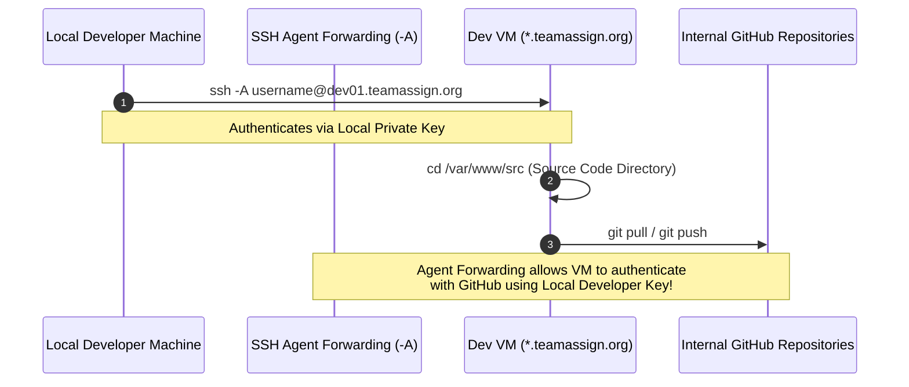

import { Steps, Aside, Tabs, TabItem } from '@astrojs/starlight/components';

<Aside type="note" title="Author's Institutional Knowledge Note">
This is a sanitized excerpt from a comprehensive onboarding guide I independently researched, tested, and authored over a 2-year period for a legacy Perl monolith with zero prior documentation. It demonstrates my ability to navigate unfamiliar codebases, document complex OAuth 2.0 flows, and build self-service developer resources.
</Aside>

This guide walks new engineers through configuring their public crypto keys, logging into their assigned developer virtual machines (`*.teamassign.org`), setting up Visual Studio Code Remote-SSH sessions, and interacting with the backend PostgreSQL database.

---

## Public Crypto Key Setup 🔑

A public crypto key (`RSA` or `Ed25519`) is required to gain secure access to TeamAssign’s GitHub repository (`teamassign/Teamassign-Web`) and remote access to the AWS virtual instances used for development.

<Steps>
1. **Generate an SSH Key & Add to SSH-Agent**
   Follow the official [GitHub SSH Setup Instructions](https://docs.github.com/en/authentication/connecting-to-github-with-ssh/generating-a-new-ssh-key-and-adding-it-to-the-ssh-agent) to generate a new key pair on your local machine and register it with your local `ssh-agent`.

2. **Register Key with GitHub**
   Add your generated public key (`~/.ssh/id_ed25519.pub` or `~/.ssh/id_rsa.pub`) to your GitHub account settings via [Adding a new SSH key to your GitHub account](https://docs.github.com/en/authentication/connecting-to-github-with-ssh/adding-a-new-ssh-key-to-your-github-account).

3. **Provide Key Fingerprint to System Admin**
   Retrieve and save the public key fingerprint of your SSH key. Submit this fingerprint to your system supervisor so your credentials can be whitelisted across our developer virtual machines and internal AWS infrastructure.
</Steps>

---

## Logging Into the Developer Virtual Machine ⚙️

Due to specialized Linux kernel dependencies and pre-compiled `mod_perl` environments, all active development is performed on dedicated remote virtual machines rather than natively on macOS or Windows.



### 1. Connecting with SSH Agent Forwarding (`-A`)
Connect from your local terminal using the `-A` flag (`Agent Forwarding`). This passes your local GitHub credentials through to the virtual machine so you can commit code and submit pull requests directly from `/var/www/src` without storing private keys on the remote server:

```bash
# Connect to your assigned developer instance (dev01, dev02, dev03, etc.)
ssh -A yourName@devNum.teamassign.org

# Or specifying your identity file explicitly if required:
ssh -A -i ~/.ssh/id_ed25519 yourName@devNum.teamassign.org
```

### 2. Root Access & Source Directory
Once logged into your virtual instance:
- **Root Access**: If administrative maintenance is required, run `sudo -i` or `sudo -E su` and enter your assigned password. Remember to change your root password immediately after initial setup. Run `exit` to drop back to your standard user account.
- **Source Code Navigation**: Run `cd /var/www/src` to enter the primary application directory where all Git repositories and build scripts are located.

### 3. The 3-Terminal Development Workflow
When developing code, we strongly recommend opening **three separate terminal windows** on your local machine, connecting each to your developer VM via `ssh -A`:

| Terminal Session | Role & Primary Command | Description |
| :--- | :--- | :--- |
| **Terminal 1: Code Editor** | `cd /var/www/src`<br/>`sudo vi <filename>` | Used for editing Perl modules and templates. Note: Files inside `/var/www/src` are read-only to standard users, requiring `sudo vi` (or `sudo vim`). Type `:set number` inside Vim to view line numbers. |
| **Terminal 2: Error Logs** | `cd /var/www/src`<br/>`make tail_logs` | Because runtime errors and stack traces are hidden from browser responses for security, run `make tail_logs` to stream live Apache/CGI compilation errors and debug output. |
| **Terminal 3: Database Shell** | `cd /var/www/src`<br/>`make db` | Maintains an open interactive PostgreSQL connection (`psql`) for executing queries, inspecting schema modifications, and verifying test data. |

<Aside type="note">
**Restarting Apache (`make restart_httpd`)**: If you modify core modules inside the `teamassign-lib` submodule (such as `lib/LMS/`), `mod_perl` caches the old code in worker RAM. You must run `make restart_httpd` inside `/var/www/src` to reload the Apache server and apply your backend changes.
</Aside>

### 4. Debugging with `Data::Dumper` & `warn`
When debugging Perl code, use `warn` for plain text output and `Data::Dumper` to inspect complex nested references (arrays and hashes):

```perl
# Print simple text or markers
warn "......................... START OF DEBUG SECTION .........................";

# Dump complex hash or array references
use Data::Dumper;
warn Dumper %sample_hash;
warn Dumper $sample_array_ref;
```

Because `make tail_logs` streams high volumes of server background activity, prefix your debug strings with prominent visual markers (like `.............`) so your exact line numbers stand out clearly inside the log stream.

---

## SSH Sessions to Your Dev Machine Within VS Code

If you prefer Visual Studio Code over terminal Vim, you can connect VS Code directly to your remote developer virtual machine:

### Initial VS Code Remote-SSH Setup
1. Open VS Code and press `Cmd+P` (Mac) or `Ctrl+P` (Windows/Linux), then type `> ssh` and select **Remote-SSH: Add New SSH Host**.
2. Enter your SSH connection command: `ssh -A yourName@devNum.teamassign.org` and hit Enter.
3. Select your local SSH configuration file (`~/.ssh/config`) to save the host entry.
4. Click **Connect** on the popup notification.
5. Once inside the remote instance, click **Open Folder** in the File Explorer, type `/var/www/src`, and click **OK**.

### Reconnecting & Troubleshooting
- **Quick Reconnect**: On subsequent launches, select your dev machine directly from the **Remote Explorer** tab or choose `/var/www/src` under **Recent Folders** on the VS Code welcome screen.
- **Connection Hanging / Overload**: Avoid opening too many simultaneous SSH windows to the same dev machine, as excessive language server background processes can exhaust VM memory. If connections hang, delete the remote `~/.vscode-server` folder on the VM and reconnect.
- **Linux Distribution Compatibility (`glibc < 2.28`)**: If you receive an error stating *"You're connected to an OS version that is unsupported by Visual Studio Code"*, your local VS Code version has upgraded past support for the VM's legacy `glibc` kernel. To continue using Remote-SSH on older CentOS/Red Hat dev machines, downgrade your local VS Code installation to **version 1.85** or earlier.

---

## TeamAssign PostgreSQL Database Shell & Commands 📊

All developer virtual machines use **PostgreSQL** as the primary relational database. To inspect tables, query test records, or modify user statuses directly on your dev machine, run `make db` inside `/var/www/src` to enter the interactive `psql` interface.

### Essential Database Commands & SQL Reference

| Command / SQL Syntax | Description & Practical Usage |
| :--- | :--- |
| `\dt` | Lists all tables in the current database schema. Press `Space` to paginate through rows, and `q` to exit the pager. |
| `\d <table_name>;` | Describes table structure, column types, foreign keys, and indexes for `<table_name>`. |
| `table <table_name>;` | Lists all records inside `<table_name>` (shorthand equivalent to `SELECT * FROM <table_name>;`). |
| `SELECT count(id) FROM <table_name> WHERE <criteria>;` | Counts total records matching specific filter criteria across rosters or surveys. |
| `SELECT * FROM <table_name> WHERE <column> = '<string>';` | Exact string match queries (e.g., finding a student by `email` or `school`). |
| `SELECT * FROM <table_name> WHERE <column> LIKE '%' \|\| '<substring>' \|\| '%';` | Substring pattern search in PostgreSQL using string concatenation (`\|\|`). |
| `UPDATE <table_name> SET <column> = <updated_data> WHERE <criteria>;` | Updates specific attributes (such as resetting survey deadlines or activating test user flags). |
| `\q` | Exits the PostgreSQL database interface and returns to the standard Linux shell. |
