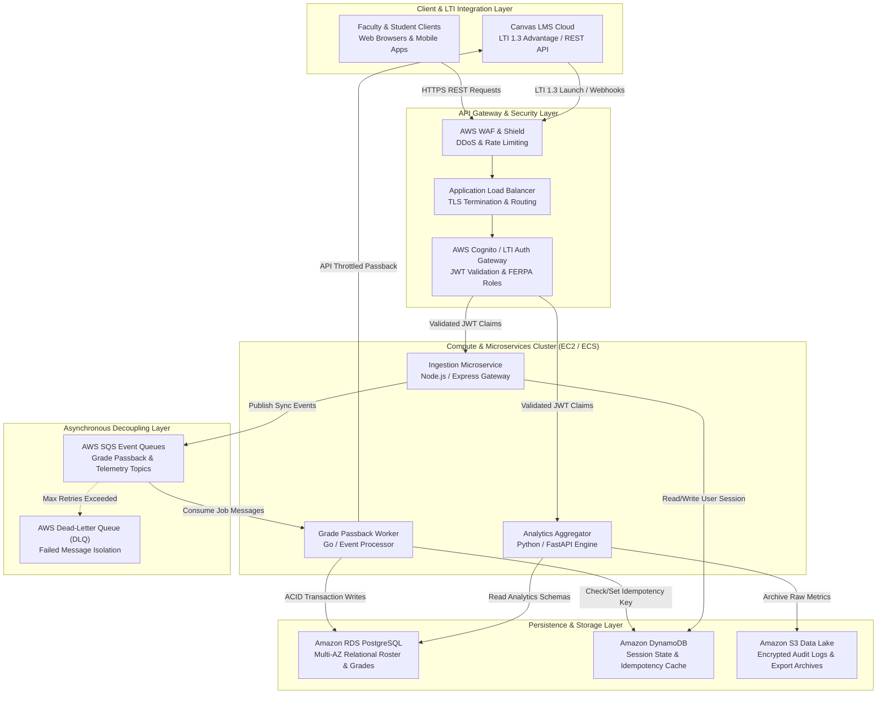

import { Card, CardGrid, Aside, Steps, Tabs, TabItem } from '@astrojs/starlight/components';

During enterprise systems integration initiatives within higher education and edtech ecosystems, bridging third-party Learning Management Systems (such as Canvas LMS) with scalable AWS cloud infrastructure requires rigorous architectural decomposition. As Technical Program Managers and System Architects, we must reconcile tight institutional security mandates (FERPA compliance, OAuth 2.0 / LTI 1.3 standards) with high-throughput backend data synchronization.

This document outlines the end-to-end cloud system architecture designed and deployed during our production integration initiatives. We examine the core system architecture diagrams, the critical trade-offs between synchronous APIs and asynchronous event queues, and our cross-functional communication strategies with non-technical university stakeholders.

## End-to-End System Architecture

To handle tens of thousands of concurrent student submissions, real-time gradebook passbacks, and high-frequency analytical telemetry, the infrastructure decouples client ingestion from heavy relational database writes. 

The architecture leverages AWS managed services deployed across multi-AZ (Availability Zone) clusters to ensure fault tolerance and zero-downtime deployments.

---

## High-Level Business & Technical Logic

The architecture addresses three mission-critical business objectives while navigating complex technical constraints imposed by external APIs and cloud infrastructure quotas.

<CardGrid>
  <Card title="Automated Gradebook Passback" icon="approve-check">
    **Business Objective**: Eliminate manual CSV grade uploads between custom assessment tools and the official institutional Canvas gradebook, reducing administrative overhead and grading errors.  
    **Technical Logic**: Implementing LTI Assignment and Grade Services (AGS) via decoupled asynchronous workers that enforce guaranteed delivery without blocking the instructor's UI.
  </Card>
  <Card title="Real-Time Learning Analytics" icon="chart">
    **Business Objective**: Provide deans and academic advisors with real-time dashboards tracking student engagement, submission velocity, and at-risk progression patterns across thousands of concurrent courses.  
    **Technical Logic**: Stream processing student interaction telemetry into high-read DynamoDB caches and PostgreSQL read-replicas without impacting transactional database performance.
  </Card>
</CardGrid>

### Architectural Trade-off: Synchronous REST vs. Asynchronous SQS Queues

A central architectural decision involved handling Canvas API rate limits during end-of-semester grading rushes. When thousands of faculty simultaneously finalize course grades, direct synchronous REST calls to the Canvas API frequently hit concurrency ceilings ($700\text{ requests/minute/token}$ quota), resulting in HTTP `403 Forbidden` or `429 Too Many Requests` failures.

We evaluated two architectural candidates using a formal trade-off matrix:

| Evaluation Criteria | Candidate A: Synchronous Direct REST | Candidate B: Asynchronous SQS + Workers (Selected) |
| :--- | :--- | :--- |
| **User Latency** | High ($1.2\text{s} - 4.5\text{s}$ blocking API round-trip) | Immediate ($<40\text{ ms}$ `202 Accepted` acknowledgment) |
| **Rate Limit Resilience** | Poor (Immediate failure under burst traffic) | Excellent (Queue buffering with exponential backoff) |
| **System Complexity** | Low (Direct request/response coupling) | Moderate (Requires dead-letter queues and idempotency keys) |
| **Idempotency Guarantee** | Difficult (Retry loops risk double-posting) | High (Atomic DynamoDB lock per `submission_id`) |
| **Operational Cost** | Low compute overhead during idle periods | Minor overhead for persistent queue workers and DLQ monitoring |

#### Mathematical Modeling of Queue Backpressure and Rate Limiting

To guarantee that the asynchronous ingestion layer never overwhelms the downstream Canvas API gateway or triggers worker OOM (Out-of-Memory) crashes during peak burst periods, we modeled our queue backpressure using queuing theory:

$$\text{Net Queue Growth Rate } (\Delta Q) = \lambda_{\text{in}}(t) - \min\left(\mu_{\text{worker}}(t), \mathcal{R}_{\text{Canvas}}\right)$$

Where $\lambda_{\text{in}}(t)$ represents the incoming webhook ingestion rate, $\mu_{\text{worker}}(t)$ is the maximum compute processing rate of our EC2/ECS cluster, and $\mathcal{R}_{\text{Canvas}}$ is the strict external API token bucket threshold. To ensure system stability and zero message dropping, we size our SQS retention buffers such that:

$$\int_{t_0}^{t_{\text{peak}}} \left( \lambda_{\text{in}}(t) - \mathcal{R}_{\text{Canvas}} \right) dt \le \mathcal{C}_{\text{SQS}}$$

Where $\mathcal{C}_{\text{SQS}}$ is the maximum allowable queue depth before backpressure policies scale out secondary read-replicas or throttle non-critical background analytical jobs. Furthermore, worker token replenishment is governed by a strict Leaky Bucket algorithm:

$$T_{\text{avail}}(t) = \min \left( T_{\text{capacity}}, \; T_{\text{avail}}(t-1) + r \cdot \Delta t \right) - k_{\text{consumed}}$$

---

## Cross-Functional Alignment & Stakeholder Communication

Securing buy-in across disparate organizational stakeholders for complex cloud architecture requires translating technical concepts into value-driven business narratives.

<Tabs>
  <TabItem label="University Deans & Registrar" icon="user">
    ### Communicating with Executive Leadership & Non-Technical Staff
    **Core Concerns**: FERPA data privacy, institutional accreditation compliance, zero disruption during final exam periods, and transparent budget governance.
    
    **Communication Strategy**:
    - **Avoid Jargon**: Translated terms like "Idempotency Keys" and "Dead-Letter Queues" into "Double-Entry Error Prevention" and "Automated Safety Nets for Failed Grades."
    - **SLA & SLO Alignment**: Guaranteed a $99.95\%$ system uptime during grading windows and a maximum grade passback latency of under $5\text{ minutes}$.
    - **Auditability Demonstration**: Showed how the immutable Amazon S3 audit logs allow the Registrar to trace exact grade modifications for grade dispute resolutions.
  </TabItem>
  <TabItem label="Engineering & Security Leads" icon="setting">
    ### Communicating with Technical Architects & DevOps Teams
    **Core Concerns**: IAM least-privilege policies, network boundaries, CI/CD deployment safety, and RDS multi-AZ failover recovery time objectives (RTO).
    
    **Communication Strategy**:
    - **Rigorous Specifications**: Provided exact OpenAPI schemas, LTI 1.3 JSON Web Key Set (JWKS) validation workflows, and Terraform Infrastructure-as-Code (IaC) modules.
    - **Security Governance**: Justified the separation of DynamoDB session state from RDS relational rosters to limit blast radius in case of token compromise.
    - **Chaos Engineering Plan**: Established clear failure testing protocols, including simulated AWS AZ outages and forced API throttling spikes during pre-production verification sprints.
  </TabItem>
</Tabs>

---

## Step-by-Step Execution Roadmap

To deliver this multi-tier infrastructure within a strict 12-week academic deployment window, we structured the program lifecycle around clear technical gates:

<Steps>
1. **LTI 1.3 Security & API Gateway Foundations (Weeks 1–3)**
   
   Configured AWS WAF, ALB, and Cognito JWT validation layers. Established secure OAuth 2.0 handshakes between Canvas Cloud instances and local developer environments. Deployed initial Terraform state files for multi-AZ VPC peering.

2. **Core Relational & Caching Schema Design (Weeks 4–5)**
   
   Provisioned Amazon RDS PostgreSQL with strict schema constraints for student enrollments, course rosters, and assignment matrices. Deployed DynamoDB tables with Time-To-Live (TTL) attributes for transient session caching and idempotency locks.

3. **Asynchronous Worker Cluster & SQS Pipelines (Weeks 6–8)**
   
   Implemented Go and Node.js microservices running inside ECS containers. Built robust SQS message consumers featuring exponential backoff, jitter, and dead-letter queue routing for resilient grade passback.

4. **Load Testing, Chaos Spike & Stakeholder Sign-Off (Weeks 9–12)**
   
   Simulated peak end-of-semester loads ($15,000\text{ concurrent submissions/hr}$) against staging environments. Verified queue recovery during simulated Canvas API rate-limiting events. Conducted formal sign-off briefings with university academic IT leaders and security compliance auditors.
</Steps>

---

## Production Impact & Portfolio Context

This high-reliability integration pattern serves as a blueprint for all our production engineering initiatives. The principles of asynchronous decoupling, strict idempotency checks, and proactive stakeholder communication directly inform the architectural resilience of our flagship public platforms:

- **Interactive 3D WebGL Portfolio ([https://sharonwang.me](https://sharonwang.me))**: Applies the same rigorous decoupling principles between UI rendering threads and asynchronous background texture loading to preserve $60\text{ FPS}$ budgets.
- **Enterprise Headless CMS Platform ([https://raisedchurch.com](https://raisedchurch.com))**: Leverages asynchronous webhook queues and incremental edge cache invalidation to protect core serverless infrastructure from traffic spikes during live media broadcasts.

<Aside type="note" title="Engineering Takeaway">
  By treating cloud infrastructure integration as a holistic socio-technical system—where architectural resilience and stakeholder transparency are co-equal priorities—we ensure that complex software programs deliver enduring business and academic value.
</Aside>
