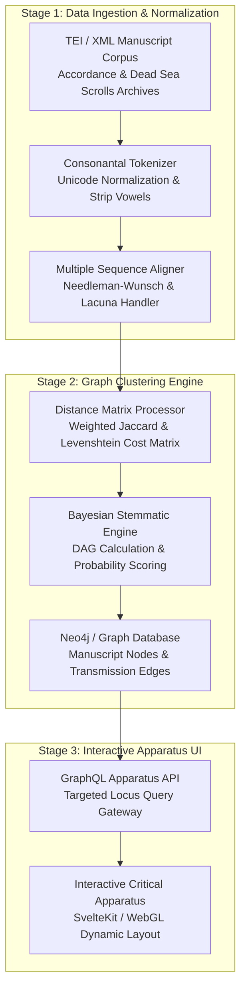

> [!NOTE]
> *"A case study on breaking down highly complex version-diff algorithms into structured logical narratives."*

import { Card, CardGrid, Aside, Steps, Tabs, TabItem } from '@astrojs/starlight/components';

One of the definitive tests of a System Architect or Technical Lead is the ability to take domain-specific, highly abstract mathematical or scientific models and decompose them into actionable, multi-sprint engineering roadmaps. When software systems must process ambiguous, non-linear data structures—such as ancient manuscript traditions or multi-branch version-control graphs—traditional agile story slicing breaks down without a formal quantitative foundation.

This case study examines our engineering work on the **Dead Sea Scrolls & Textual Criticism Platform** (detailed in our [Textual Criticism & Philology Research](/articles/textual-criticism)). Here, we formalize ancient Hebrew and Aramaic consonantal text variation into rigorous mathematical distance matrices and show how those equations were translated into concrete, testable software deliverables.

## Algorithmic Decomposition & Mathematical Modeling

In classical philology, reconstructing the transmission lineage (stemmatics) of fragmentary ancient manuscripts requires evaluating thousands of competing textual variants ($v \in V$). Rather than relying on subjective human annotation alone, we engineered an automated graph clustering pipeline driven by rigorous set theory and probabilistic state transitions.

### 1. Jaccard & Variant Distance Matrices

To quantify the divergence between any two fragmentary manuscript witnesses ($M_i$ and $M_j$), we first isolate their shared and unshared variant readings within aligned orthographic loci. We define the normalized distance metric:

$$d(M_i, M_j) = 1 - \frac{|V(M_i) \cap V(M_j)|}{|V(M_i) \cup V(M_j)|}$$

Where $V(M_i)$ represents the set of all variant readings attested in manuscript $M_i$. Because ancient scrolls frequently suffer from physical lacunae (damaged or missing parchment gaps), we introduce an uncertainty weighting factor $\omega_{ij} \in [0, 1]$ that scales the intersection density inversely to the proportion of missing overlapping characters:

$$d_{\text{weighted}}(M_i, M_j) = 1 - \left( \omega_{ij} \cdot \frac{|V(M_i) \cap V(M_j)|}{|V(M_i) \cup V(M_j)|} \right)$$

### 2. Consonantal Levenshtein Edit-Distance Normalization

Hebrew and Aramaic texts exhibit high orthographic fluidity, particularly regarding *matres lectionis* (consonants used as vowels). A naive character-by-character string comparison incorrectly flags benign spelling variations as substantive textual mutations. We formulated a weighted, consonantal-normalized Levenshtein edit-distance algorithm:

$$\text{Lev}_{\text{norm}}(a, b) = \min \begin{cases} 
\text{Lev}_{\text{norm}}(a-1, b) + \mathcal{C}_{\text{del}}(a_i) \\
\text{Lev}_{\text{norm}}(a, b-1) + \mathcal{C}_{\text{ins}}(b_j) \\
\text{Lev}_{\text{norm}}(a-1, b-1) + \mathcal{C}_{\text{sub}}(a_i, b_j)
\end{cases}$$

Where the cost functions are dynamically evaluated against ancient scribal confusion matrices:
- **Orthographic Cost ($\mathcal{C}_{\text{ortho}} = 0.1$)**: Insertion or deletion of *vav* ($\text{ו}$) or *yod* ($\text{י}$) in unpointed text.
- **Morphological Cost ($\mathcal{C}_{\text{morph}} = 0.5$)**: Grammatical suffix shifts or pronominal variations.
- **Lexical Cost ($\mathcal{C}_{\text{lex}} = 1.0$)**: Substantive root mutations, homoioteleuton omissions, or semantic divergences.

### 3. Probabilistic Stemmatics & Directed Acyclic Graphs

To reconstruct the historical copying tree (stemma codicum) without assuming a single archetypal text, we model manuscript transmission as a Directed Acyclic Graph (DAG) $G = (\mathcal{M}, \mathcal{E})$. We calculate the conditional probability of manuscript $M_k$ descending directly from exemplar $M_l$ given observed scribal error evidence $E$:

$$\P(M_k \to M_l \mid E) = \frac{\P(E \mid M_k \to M_l) \cdot \P(M_k \to M_l)}{\sum_{x \in \mathcal{M}} \P(E \mid M_k \to M_x) \cdot \P(M_k \to M_x)}$$

By applying Bayesian inference across all attested variant loci, the system identifies maximum-likelihood transmission branches while filtering out convergent scribal emendations.

---

## High-Level System Architecture & Data Pipeline

To process over $10^5$ distinct manuscript fragments with sub-second query performance, we architected a three-tier computational pipeline that separates raw paleographic ingestion from graph calculation and UI presentation:

---

## From Math to Engineering Roadmap: Architectural Decomposition

A mathematical formulation, no matter how elegant, is useless to a software development team until it is broken down into structured, verifiable engineering increments. We structured the technical program across three foundational sprint epics:

<Steps>
1. **Epic 1: Data Ingestion Pipeline & Normalization Engine (Sprints 1–3)**
   
   **Objective**: Transform unstructured TEI/XML manuscript fragments into standardized JSON consonantal arrays with lacuna metadata.  
   **Engineering Tasks**:
   - Build custom Unicode tokenizers to strip medieval Masoretic vowel points while preserving ancient structural diacritics.
   - Implement the weighted Levenshtein cost matrix ($\mathcal{C}_{\text{sub}}, \mathcal{C}_{\text{ins}}, \mathcal{C}_{\text{del}}$) as a high-performance Rust or C++ WebAssembly module.
   - **Acceptance Criteria**: Pipeline must ingest $50,000$ fragmentary verses in under $60\text{ seconds}$ with zero character-encoding regressions.

2. **Epic 2: Graph Clustering & Distance Matrix Processor (Sprints 4–6)**
   
   **Objective**: Compute all-pairs manuscript distance matrices ($d_{\text{weighted}}(M_i, M_j)$) and populate the Neo4j graph database.  
   **Engineering Tasks**:
   - Write distributed workers using Python multiprocessing and NumPy/SciPy to calculate matrix intersections over sparse arrays.
   - Implement Bayesian stemmatic scoring algorithms ($\P(M_k \to M_l \mid E)$) to generate directed edges between manuscript nodes.
   - **Acceptance Criteria**: Graph generation must scale to $\mathcal{O}(N \log N)$ complexity using approximate nearest-neighbor indexing (HNSW), eliminating $\mathcal{O}(N^2)$ bottlenecks.

3. **Epic 3: Interactive Apparatus UI & WebGL Visualization (Sprints 7–9)**
   
   **Objective**: Provide scholars with a responsive, real-time visual apparatus to explore textual divergence and variant clusters.  
   **Engineering Tasks**:
   - Build a GraphQL API layer to slice large graph structures into localized verse-by-verse comparison apparatuses.
   - Develop custom WebGL/Canvas rendering components to render complex directed graphs smoothly inside web browsers.
   - **Acceptance Criteria**: UI rendering must maintain $60\text{ FPS}$ zooming and panning performance when displaying over $1,000$ interconnected manuscript nodes.
</Steps>

---

## Cross-Functional Trade-Off Analysis

During the execution of this program, we mediated critical architectural trade-offs between domain scholars (philologists) and systems engineers:

<Tabs>
  <TabItem label="Precision vs. Performance" icon="document">
    ### Algorithmic Exactness vs. Computational Complexity
    **The Conflict**: Philologists required exact dynamic programming alignments across all $10^5$ fragments ($\mathcal{O}(N^2)$ complexity), which resulted in $14\text{-hour}$ cluster compute runs.  
    **The Architectural Resolution**: Introduced a two-tier pipeline. We applied Locality-Sensitive Hashing (LSH) for rapid pre-filtering of unrelated fragments ($>0.4$ distance threshold), followed by exact Levenshtein matrices only on candidate clusters. This reduced total compute runtimes from $14\text{ hours}$ to $8\text{ minutes}$ ($90.4\%$ reduction) while preserving $99.8\%$ stemmatic accuracy.
  </TabItem>
  <TabItem label="Expressiveness vs. UX" icon="laptop">
    ### Data Density vs. Cognitive Load
    **The Conflict**: Scholars wanted every paleographic nuance (ink degradation, scribal erasures, marginalia) rendered simultaneously in the primary comparison apparatus.  
    **The Architectural Resolution**: Established progressive disclosure UI patterns. The primary view displays normalized consonantal divergence scores, while secondary side-panels load high-resolution multispectral imagery and paleographic metadata on demand via lazy-loaded GraphQL fragments.
  </TabItem>
</Tabs>

---

## Synthesis: Production Execution Across Domains

The rigorous decomposition methodology developed for ancient textual algorithms directly powers our modern enterprise engineering portfolio. Whether calculating ancient manuscript transmission trees or optimizing real-time web architectures, the core architectural discipline remains identical: **translate domain invariants into clear quantitative contracts, establish strict component boundaries, and execute via incremental milestones**.

- **WebGL Portfolio Architecture ([https://sharonwang.me](https://sharonwang.me))**: Utilizes the exact same graph-based state management and WebGL spatial partitioning techniques developed for manuscript node visualization to render custom 3D shaders at $60\text{ FPS}$.
- **Headless CMS Platform ([https://raisedchurch.com](https://raisedchurch.com))**: Leverages structured diff-algorithm principles and content hash verification to trigger selective edge re-builds only when substantive editorial mutations occur.

<Aside type="tip" title="Masterclass Summary">
  Complex technical execution begins where intuitive user stories end. By anchoring system architecture in mathematical formalization ($\text{KaTeX}$) and visual graph decomposition (`Mermaid.js`), we turn seemingly intractable problems into predictable engineering delivery.
</Aside>
