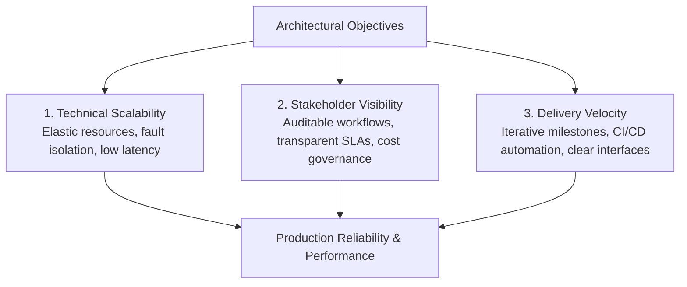
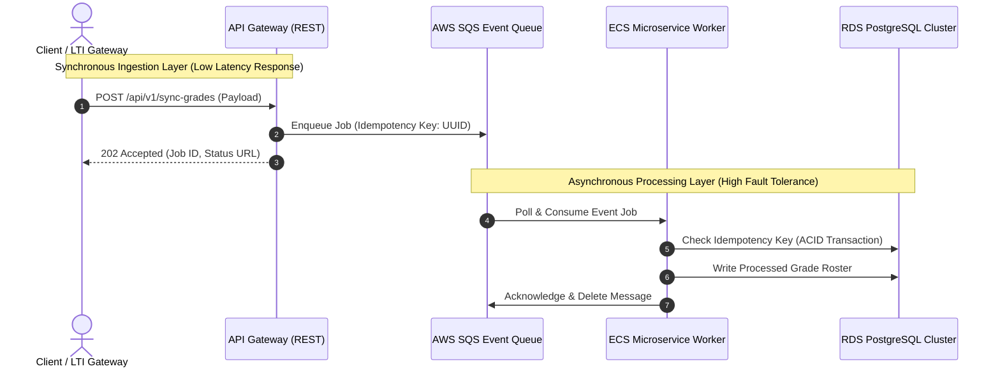

import { Card, CardGrid, Aside, Steps, Tabs, TabItem } from '@astrojs/starlight/components';

As Technical Program Managers (TPMs) and System Architects, our primary mandate is bridging the gap between high-level business objectives, abstract algorithmic models, and highly reliable, scalable engineering implementations. System architecture is not merely about choosing technology stacks; it is about establishing clear operational boundaries, mitigating distributed systems complexity, and establishing predictable delivery velocities across cross-functional engineering teams.

This section documents our comprehensive architectural philosophy, systems decomposition frameworks, and real-world production case studies. Every architecture detailed here is grounded in live production deployments, including our interactive WebGL portfolio ([https://sharonwang.me](https://sharonwang.me)) and our enterprise-grade headless CMS deployment ([https://raisedchurch.com](https://raisedchurch.com)).

## Architectural Philosophy: Scalability vs. Velocity

Modern technical program management requires continuously navigating a fundamental engineering trade-off: **long-term architectural scalability versus immediate stakeholder delivery speed**. An over-engineered system introduces unnecessary maintenance burdens and delays time-to-market, while an under-architected system accumulates crippling technical debt and fails under peak production loads.

We evaluate architectural decisions using a formal prioritization matrix grounded in three core pillars:

### The Three Pillars of Engineering Execution

1. **Technical Scalability & Fault Isolation**: Systems must be designed with strict API boundaries, idempotent transaction guarantees, and asynchronous decoupling where synchronous coupling would create cascading failure vectors.
2. **Stakeholder Visibility & Governance**: Engineering architecture must remain transparent to product leaders, compliance officers, and executive sponsors. We translate complex distributed systems behaviors into clear Service Level Objectives (SLOs), error budgets, and financial cost-per-request models.
3. **Delivery Velocity & Iterative Milestones**: Complex multi-quarter technical initiatives must be decomposed into independently deployable increments. By establishing robust API contracts early, parallel workstreams can proceed without blocking dependencies.

---

## Live Production Architectures

Our architectural methodology is demonstrated across two flagship production deployments, each addressing diametrically opposed system constraints and stakeholder requirements.

<CardGrid>
  <Card title="Interactive WebGL Platform" icon="laptop">
    **Live Deployment**: [https://sharonwang.me](https://sharonwang.me)  
    **Architecture**: Single-Page Application (SPA) with React Three Fiber, custom GLSL shaders, and dynamic LOD state management.  
    **Core Challenge**: Maintaining strict $16.67\text{ ms}$ frame budgets across heterogeneous mobile and desktop GPUs while processing complex 3D scene graphs and spatial state.
  </Card>
  <Card title="Enterprise Headless CMS" icon="rocket">
    **Live Deployment**: [https://raisedchurch.com](https://raisedchurch.com)  
    **Architecture**: SvelteKit Server-Side Rendering (SSR) coupled with Contentful GraphQL API and webhook-driven Incremental Static Regeneration (ISR).  
    **Core Challenge**: Decoupling non-technical editorial workflows from high-performance edge delivery while eliminating build bottlenecks and API rate limiting.
  </Card>
</CardGrid>

---

## Formal Systems Decomposition Methodology

Translating abstract mathematical algorithms or complex business logic into structured engineering roadmaps requires a rigorous, four-stage decomposition lifecycle. This framework ensures that every line of code traces directly to an explicit architectural requirement and stakeholder outcome.

<Steps>
1. **Domain Modeling & Mathematical Formalization**
   
   Before defining software interfaces, we formalize the core problem domain using precise mathematical invariants and data models. For data-intensive pipelines (such as our [Dead Sea Scrolls Case Study](/architecture/complex-logic-breakdown)), we define explicit formal metrics, distance formulas, and state transition probabilities using rigorous LaTeX/KaTeX formulations:
   $$\mathcal{S}_{total} = \sum_{i=1}^{n} \left( \alpha \cdot \mathcal{C}_{comp}(i) + \beta \cdot \mathcal{C}_{net}(i) \right)$$
   Where $\mathcal{C}_{comp}$ represents compute complexity, $\mathcal{C}_{net}$ represents network serialization overhead, and $\alpha, \beta$ are weight factors tuned to operational budgets.

2. **Boundary Identification & Interface Definition**
   
   Once the domain model is formalized, we establish strict system boundaries. We determine which components require synchronous request-response guarantees versus asynchronous event-driven queues. Every cross-service boundary is formalized via OpenAPI contracts, GraphQL schemas, or Protocol Buffers before implementation begins.

3. **Trade-off Evaluation & Risk Mitigation**
   
   Every architectural decision introduces compromises. We conduct structured Architecture Trade-off Analysis Method (ATAM) evaluations to assess alternatives against quality attributes:
   - **Throughput vs. Latency**: Batching database operations to maximize throughput versus handling individual records to minimize p99 latency.
   - **Consistency vs. Availability**: Applying CAP theorem constraints to determine where eventual consistency is acceptable versus where ACID compliance is mandatory.

4. **Iterative Roadmap & Program Execution**
   
   The finalized architecture is sliced into vertical, end-to-end user stories across discrete sprint milestones. We utilize critical path analysis and dependency mapping to ensure that high-risk technical unknowns (e.g., custom shader performance or third-party LTI integrations) are prototyped and retired during early engineering spikes.
</Steps>

---

## Architectural Decision Records (ADR) Framework

To maintain long-term alignment across distributed engineering teams and executive leadership, we enforce the adoption of formal Architectural Decision Records (ADRs). ADRs institutionalize institutional memory and prevent cyclic debates over settled technical architecture.

<Aside type="tip" title="Standard ADR Structure">
  Every significant system modification requires a documented ADR containing five core sections: **Context**, **Decision**, **Consequences**, **Compliance/Verification**, and **Stakeholder Sign-off**. This creates an immutable audit trail for technical program management.
</Aside>

### Sample High-Level Architecture Flow: Synchronous vs. Asynchronous Decoupling

When integrating external enterprise platforms—such as university Learning Management Systems or cloud infrastructure services—we frequently transition legacy synchronous architectures to decoupled, resilient event-driven systems:

---

## Deep-Dive Case Studies in This Section

Explore our comprehensive case studies to see how these architectural methodologies are applied across enterprise cloud integrations, complex computational linguistics, and high-performance web applications:

<Tabs>
  <TabItem label="Cloud Infrastructure & LMS" icon="cloud">
    ### [Canvas LMS & AWS Cloud Infrastructure](/architecture/canvas-aws-system-architecture)
    Examine the enterprise-grade integration between Canvas LMS and AWS backend infrastructure. Dive into detailed data flow diagrams, LTI 1.3 security gateways, asynchronous SQS event processing, and comprehensive stakeholder communication strategies used to align university leadership with engineering execution.
  </TabItem>
  <TabItem label="Algorithmic Decomposition" icon="puzzle">
    ### [Dead Sea Scrolls Case Study: Complex Logic Breakdown](/architecture/complex-logic-breakdown)
    Discover how extreme abstract philological algorithms, Levenshtein distance normalization matrices, and probabilistic stemmatics equations ($\P(M_k \to M_l | E)$) are decomposed into a structured, multi-sprint engineering roadmap for high-performance graph clustering and interactive visual apparatuses.
  </TabItem>
  <TabItem label="Production System Designs" icon="setting">
    ### [Comparative Architectural Trade-offs](/architecture/project-system-designs)
    Review a comparative analysis between two live production environments: the server-side rendered, headless CMS architecture of [https://raisedchurch.com](https://raisedchurch.com) versus the real-time WebGL frame-rate optimization strategies of [https://sharonwang.me](https://sharonwang.me). Includes an architectural evaluation matrix covering scalability, maintainability, and stakeholder satisfaction.
  </TabItem>
</Tabs>

---

## Summary of Architectural Metrics & SLAs

Across all portfolio architectures, we enforce quantitative engineering standards to ensure production grade reliability and maintainability:

| Quality Attribute | Target Metric | Verification Method | Demonstrated In |
| :--- | :--- | :--- | :--- |
| **System Availability** | $99.95\%$ Uptime SLA | Synthetic monitoring & automated failover | [Canvas AWS Infrastructure](/architecture/canvas-aws-system-architecture) |
| **Interactive Latency** | $\le 16.67\text{ ms}$ Frame Render | Chrome DevTools GPU profiler & FPS meters | [3D WebGL Portfolio](https://sharonwang.me) |
| **Data Consistency** | Zero-loss Idempotent Processing | Distributed transaction tracing & dead-letter queues | [Canvas AWS Infrastructure](/architecture/canvas-aws-system-architecture) |
| **Content Delivery** | $\le 100\text{ ms}$ Time-to-First-Byte | Global edge CDN caching & ISR revalidation | [Headless CMS Platform](https://raisedchurch.com) |
| **Algorithmic Scaling** | $\mathcal{O}(N \log N)$ Graph Clustering | Benchmark profiling over $10^5$ manuscript variants | [Complex Logic Breakdown](/architecture/complex-logic-breakdown) |
