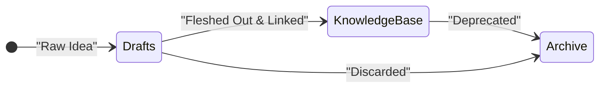

import { Aside, Card, CardGrid, Steps } from '@astrojs/starlight/components';

## Introduction

When I started my first full-time software engineering job out of college, I soon realized the old way of note taking I relied on my entire life was no longer enough. New information came hosing down every day, from internal frameworks, business logic, to complex system architectures people have been working on for years. I was completely clueless, not even knowing how to book a meeting with my manager on a laptop that runs on an operating system I've never used before.

That is when I began experimenting with non-traditional ways of knowledge management, eventually settling on using Obsidian as my main tool. I'll be sharing the current setup of my Obsidian vault in this article, from plugins, directory structure, to the AI tools I use the manage, retrieve, and grow my knowledge base. 

<Aside type="tip" title="Starter Template">
If you're interested in using my exact setup as a starting point, you can find my base vault template on [GitHub](https://github.com/sharonwang554/obsidian-vault-setup). My setup and workflow were heavily inspired by and adapted from the [Linking Your Thinking YouTube channel](https://youtube.com/@linkingyourthinking?si=4GeY4z-PFM2D90QE), particularly [this video](https://youtu.be/z4AbijUCoKU).
</Aside>

## Why Folder Structure Doesn't Work

Over time, I've realized that a rigid, hierarchical folder structure just doesn't work for my brain. A heavily nested labyrinth forces you to decide exactly where a piece of information belongs before you even fully understand it. Is a note about a new Python script a "Project," a "Code Snippet," or a "Tutorial?" 

When we try to force organic thoughts into rigid folders, we create friction. Notes get lost in deep subdirectories, and we stop making connections across different disciplines.

## Enter Maps of Content (MOCs)

Instead of relying on folders, I use **Maps of Content (MOCs)** to navigate my vault. An MOC is simply a note that serves as an index or a hub for a specific topic, linking out to other related notes. 

This linked structure makes it drastically easier to **find** information later. Instead of digging through three layers of folders trying to remember where you saved a snippet, you just jump to the relevant MOC and follow the associative links—exactly how human memory actually works. And because MOCs are powered by **Dataview** queries, they are completely self-assembling. As soon as you tag a new note with a topic, it automatically appears dynamically listed in that MOC's index. You never have to manually update a folder or index page again.

<Aside type="tip" title="AI-Friendly Structure">
This flat, heavily linked MOC approach isn't just great for humans; **it is vastly superior for AI agents.** Because the vault operates like a knowledge graph, AI tools can easily traverse structural links and bidirectional relationships to parse context, retrieve information semantically, and infer connections in ways that rigid folder hierarchies make nearly impossible.
</Aside>

<Aside type="note">
By using MOCs, you treat your vault like a Wikipedia. You can enter a topic from a high-level dashboard and drill down into atomic, highly focused notes. It allows your knowledge to grow organically, bubbling up into MOCs only when a topic gets too large to manage on its own.
</Aside>

## Setting Up MOCs and Obsidian Essentials

While I rely heavily on links and MOCs, I still use a *very flat* set of utility folders to manage the lifecycle of my notes. A note typically flows through three distinct stages:

<Steps>
1. **Drafts**: This is the inbox. It's a staging area for unstructured ideas, quick thoughts, and unfinished notes that aren't quite fully baked yet.
2. **Knowledge Base**: Once a draft is fleshed out into an atomic, focused concept, it graduates to the core of my vault. This is where permanent knowledge lives, stripped of temporary context.
3. **Archive**: If a note becomes obsolete or deprecated, it gets moved here rather than deleted, ensuring the active workspace stays clean without losing historical data.
</Steps>

I also have a few fixed utility folders: 

- **Dashboards** & **Topics**: Used for index pages, kanbans, complicated views aggregated using dataview, and entry point MOCs.
- **Daily Notes** & **Weekly Summary**: For tracking day-to-day progress and housing the reports generated by my AI skills.
- **Templates** & **Attachments**: I explicitly configure Obsidian's settings to route all newly pasted images and PDFs strictly to the `Attachments` folder, preventing root clutter.

### Core Settings & Essential Plugins

Before diving into plugins, there are a few native Obsidian settings (stored in `.obsidian/app.json`) that are absolutely critical to making this MOC-driven workflow survive:

<Aside type="danger" title="Critical Setting">
**Automatically update internal links (`alwaysUpdateLinks`)**: *Turn this on immediately.* This ensures that if you rename a note, every single MOC or note linking to it updates automatically.
</Aside>

- **Default location for new notes (`newFileLocation`)**: Set to the `Drafts` folder so spontaneous ideas don't litter the root.
- **Default location for attachments (`attachmentFolderPath`)**: Routed directly to the `Attachments` folder. 
- **Show unsupported files (`showUnsupportedFiles`)**: Turned on so the vault can act as a true file system for arbitrary project assets.

Obsidian is beautifully minimal out of the box, but part of its magic is the community ecosystem. I rely on a mix of plugins to make this workflow sing:

- **Data & Querying (`dataview`, `omnisearch`)**: `dataview` is indispensable for treating the vault like a living database. I use it to pull dynamic lists of notes into my Dashboards based on metadata. `omnisearch` saves me whenever I need advanced full-text search.
- **Visuals & Diagrams (`obsidian-excalidraw-plugin`, `mermaid-tools`, `advanced-canvas`)**: I use these for spatial thinking. Instead of text, I can map out architectures, draw mindmaps, and visualize concepts right inside the vault.
- **Presentations (`obsidian-advanced-slides`)**: With this plugin, I can write standard markdown, divide slides using horizontal rules (`---`), and render them instantly as a presentation.
- **Formatting & Utility (`templater-obsidian`, `obsidian-linter`, `obsidian-git`, `terminal`)**: Crucially, I use the `terminal` plugin to launch AI tools directly inside Obsidian (Copilot CLI, Claude, OpenCode). This keeps my workflow tool-agnostic.

### Templates

To maintain consistency, I keep a small set of core templates in the `Templates` directory to remove the friction of staring at a blank page. 

<Aside type="tip" title="The 'relate to:' Property">
My **General.md** template includes a **`relate to:`** YAML property. This simple field forces me to pause and link the new note to related topics or MOCs right off the bat, integrating it into the broader web of knowledge.
</Aside>

Other key templates include:
- **Topic.md**: Instantly spins up a new MOC. It comes pre-loaded with an automated dataview query (`contains(file.outlinks, this.file.link)`) that actively scans the vault and lists any files linking to the topic.
- **Daily Note.md**: Comes pre-structured with `### Morning` and `### Afternoon` sections to track activities and thoughts precisely throughout the day.
- **Presentation.md**: A scaffold for Advanced Slides with pre-built title, agenda, and detail slides, making slide creation effortless. 

## Supercharging with AI Skills and Agents

Perhaps the most transformative part of my setup is the hidden `.agents` directory at the root of the vault. This is where I store configurations and custom instructions that allow AI to operate over my notes as an active participant in my thinking process. 

<Aside type="note">
Many of the base skills I use were adapted from [kepano/obsidian-skills](https://github.com/kepano/obsidian-skills), and I use the [Skill Creator plugin](https://claude.com/plugins/skill-creator) to quickly build out my own custom ones.
</Aside>

Inside `.agents/Skills/`, I've defined specialized instructions for the AI to perform complex, tedious tasks for me:

- **Logging & Synthesis**: I use my **Daily Note.md** template to meticulously log everything I work on. At the end of the week, my **Weekly Synthesis** agent automatically reads through all these daily logs and distills them into a clean, formatted weekly report for my manager.
- **Knowledge Discovery**: This skill analyzes the `Knowledge Base` to uncover hidden correlations and non-obvious connections between disparate atomic concepts. 
- **Semantic Retrieval**: I rely heavily on AI to extract specific information when I've completely forgotten which file it lives in, querying the vault based on concepts rather than rigid keywords.
- **Active Housekeeping**: These agents automatically process my raw inbox dumps in `Drafts` (formatting and tagging them), sweep through the vault to fix broken links, and keep the overall structure pristine.

<Aside type="tip" title="The Second Brain">
I've found that these agents work incredibly well—provided I do my part by keeping the notes atomic, using the `relate to` property to link them properly (`[[like this]]`), and using YAML frontmatter for structured metadata. It truly feels like I have a second brain working alongside my own.
</Aside>