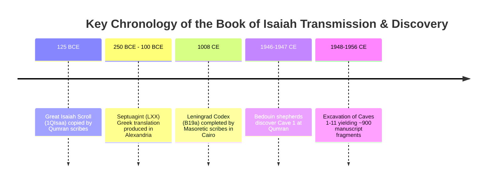
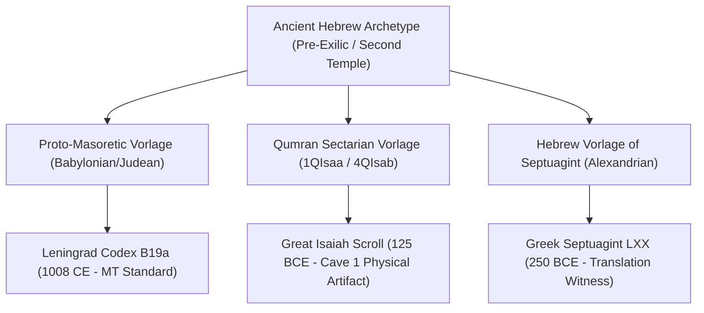

import { Aside, Card, CardGrid, Tabs, TabItem } from '@astrojs/starlight/components';

<Aside type="note" title="Scholarly Documentation & Archival Notice">
This academic research paper examines the paleographical, philological, and theological variations uncovered between the **Great Isaiah Scroll (`1QIsa^a`)** discovered at Qumran and the medieval **Masoretic Text (MT)**. Originally authored as part of an advanced biblical studies and textual criticism curriculum, this document has been enhanced with formal stemmatic models, statistical variant distributions, and side-by-side manuscript collations.
</Aside>

## Abstract & Preface

The discovery of the Dead Sea Scrolls in the mid-20th century revolutionized the field of biblical textual criticism. Among the 220 biblical scrolls uncovered in the eleven caves of Qumran near the northwestern shore of the Dead Sea, the book of Isaiah stands out as the best-preserved and the only nearly complete manuscript tradition (`1QIsa^a`). Dating to approximately 125–100 BCE, `1QIsa^a` provides a physical witness to the Hebrew text nearly one thousand years older than the oldest complete medieval Masoretic manuscript, the Leningrad Codex (`B19a`, dated 1008 CE).

This study investigates the transmission fidelity of the Hebrew text over a millennium of manual copying and analyzes five critical passages where discrepancies between `1QIsa^a` and the Masoretic Text reveal deep theological, scribal, and historical nuances.

---

## 1. Discovery and Historical Significance of the Qumran Cache

In late 1946 or early 1947, Bedouin shepherds Muhammed edh-Dhib and his cousin Jum’a Muhammed from the Ta'amireh tribe were tending their flocks along the desert cliffs near Khirbet Qumran. While searching for a lost goat, one of them cast a stone into a cave opening and heard the distinct sound of shattering pottery. Entering the cave (now designated **Cave 1**), they uncovered several tall clay jars housing leather and papyrus scrolls wrapped in linen.



### Transmission Fidelity & Scribal Accuracy

A central question confronting philologists upon the unsealing of `1QIsa^a` was whether one thousand years of manual scribal copying had introduced massive corruption into the biblical text. Comparative collation revealed an astonishing degree of structural and consonantal stability between the Qumran scrolls and the medieval Masoretic Text.

We can model the total textual variance $V_{\text{tot}}$ observed across the 66 chapters of Isaiah between `1QIsa^a` and `MT` using the following mathematical partition:

$$
V_{\text{tot}} = V_{\text{orth}} + V_{\text{err}} + V_{\text{sem}}
$$

Where:
- $V_{\text{orth}}$ represents **orthographic and morphological divergence** (approximately $85\%$ of all variants), such as *plene* spelling (adding *matres lectionis* like `ו` and `י` to indicate vowels, e.g., `לוא` vs `לא`) and pronoun suffixes (`-כה` vs `-ך`).
- $V_{\text{err}}$ represents **mechanical scribal errors** (approximately $12\%$), including *homoioarcton*, *homoioteleuton*, dittography, and haplography.
- $V_{\text{sem}}$ represents **substantive semantic variants** (approximately $3\%$), where word additions, omissions, or proper noun combinations meaningfully alter the syntax or theological interpretation.

<CardGrid>
  <Card title="Orthographic Fluidity" icon="document">
    In English, orthographic shifts like *honor* vs. *honour* or *canceled* vs. *cancelled* reflect regional spelling conventions without altering semantic meaning. Similarly, Qumran scribes frequently utilized full (*plene*) orthography to aid pronunciation before the invention of Tiberian vowel points.
  </Card>
  <Card title="Scribal Reverence" icon="approve-check">
    Scribes from different Second Temple sectarian traditions exhibited varying practices regarding sacred divine names, sometimes writing the Tetragrammaton (`יהוה`) freely, and other times substituting it with archaic Paleo-Hebrew script or four warning dots (*tetrapuncta*).
  </Card>
</CardGrid>

---

## 2. Comprehensive Collation of Five Major Discrepancies

While the vast majority of differences between `1QIsa^a` and `MT` fall under $V_{\text{orth}}$, the handful of substantive semantic variants ($V_{\text{sem}}$) provide extraordinary insights into Second Temple exegesis and the history of biblical translation. Below is a detailed comparative analysis of five pivotal passages.

### Summary Collation Table

| Passage | Masoretic Text (MT / Leningrad Codex) | Great Isaiah Scroll (`1QIsa^a`) | Septuagint (LXX / Greek) | Primary Philological / Exegetical Significance |
| :--- | :--- | :--- | :--- | :--- |
| **Isaiah 40:7–8** | Longer version: Includes *"Grass withers... when the breath of YHWH blows on them. Surely the people are grass."* | Preserves **both**: First scribe wrote shorter LXX version; second scribe added MT expansion in margin with *tetrapuncta*. | Shorter version (omits lines 7b–8a due to *homoioteleuton* or alternative *Vorlage*). | Demonstrates co-existing scribal traditions and reverence practices (*tetrapuncta*) for divine names. |
| **Isaiah 53:11** | `מעמל נפשו יראה ישבע` (*"From the labor of his soul, he will see, he will be satisfied"*) | `מעמל נפשוה יראה אור וישבע` (*"From the labor of his soul, he will see **light** and be satisfied"*) | `δεῖξαι αὐτῷ φῶς` (*"to show him **light**"*) | The addition of **`אור` (light)** connects with resurrection/life metaphors found in Job 33:28. |
| **Isaiah 9:6** | Separated words: `אל גבור` (*Mighty God*), `אבי עד` (*Everlasting Father*), `שר שלום` (*Prince of Peace*) | Compound proper names: `אלגבור` (*Elgibor*), `אבי עד` (*Aviyad*), `שר השלום` (*Ruler of Hashalom*) | `Μεγάλης βουλῆς ἄγγελος` (*Messenger of Great Counsel*) | Indicates Qumran scribes treated these titles as royal compound throne names (*Elgibor*, *Aviyad*). |
| **Isaiah 7:14** | `אדוני` (*Adonai* / Lord); `וקראת` (*v'qarat* / **she** will call); `עמנו אל` (*Imanu El* separated) | `יהוה` (*YHWH*); `וקרא` (*v'qara* / **he** will call); `עמנואל` (*Immanuel* combined) | `Κύριος` (*Lord*); `καλέσεις` (*you will call*); `Εμμανουηλ` | Reflects divine name traditions and highlights royal compound naming emphasis (`Immanuel`). |
| **Isaiah 61:1** | `לקרוא לשבויים דרור ולאסורים פקח קוח` (*"freedom to prisoners, opening of prison to bound"*) | Includes *"opening the eyes"* (`פקח-עור`) or *"release from darkness"* alongside liberty. | `τυφλοῖς ἀνάβλεψιν` (*"recovery of sight to the blind"*) | Directly resolves Luke 4:18 quotation, proving Jesus read/cited a Hebrew version containing sight recovery. |

---

### Detailed Passage Analysis

<Tabs>
  <TabItem label="1. Isaiah 40:7–8 (Scribal Traditions)">
    #### The Dual Witness of Isaiah 40:7–8

    These two verses present one of the most fascinating phenomena in the entire Qumran corpus because `1QIsa^a` actually preserves **both** the shorter Septuagint tradition and the longer Masoretic expansion on a single physical page.

    1. **The Primary Layer (Scribe A):** The original scribe of `1QIsa^a` wrote the shorter version directly into the column: *"Grass withers, flowers fade, but the word of our God remains forever."* This matches the Greek Septuagint exactly.
    2. **The Secondary Layer (Scribe B):** A subsequent corrector inserted the missing phrases into the margin and interlinear space above: *"Grass withers and flowers fade when the breath of YHWH blows on them. Surely the people are grass. Grass withers and flowers fade, but the word of our God remains forever."*

    ```diff
      [Primary Column Text by Scribe A]
      Grass withers, flowers fade,
    + [Inserted in Margin by Scribe B with Tetrapuncta: when the breath of .... blows on them. Surely the people are grass. Grass withers and flowers fade,]
      but the word of our God remains forever.
    ```

    #### Philological Evaluation of Tetrapuncta
    Rather than assuming Scribe B arbitrarily altered the text, modern stemmatic analysis indicates that two distinct scribes operated from different regional textual traditions (*Vorlagen*). Crucially, where the divine name `יהוה` occurred in the inserted line, Scribe B did not write the letters but instead inscribed four dots (`....`), known as **tetrapuncta**. 

    This proves that Scribe B adhered to a strict sectarian reverence tradition that prohibited speaking or writing the divine Tetragrammaton out of sacred caution, whereas Scribe A freely wrote divine titles. Today, major translations like the **NIV** and **NRSV** adopt the longer Masoretic expansion while noting the complex transmission in critical footnotes.
  </TabItem>

  <TabItem label="2. Isaiah 53:11 (The Suffering Servant)">
    #### The Metaphor of Light and Life (`אור`)

    Isaiah 53:11 forms the climactic resolution to the famous poem of the Suffering Servant. A profound consonantal variance exists between the medieval tradition and the Dead Sea Scrolls regarding the noun **light (`אור`)**.

    - **Masoretic Text (`MT`):**  
      `מעמל נפשו יראה ישבע`  
      *Transliteration:* `me'amal nafsho yir'eh yisba'`  
      *Literal Translation:* "From the labor of his soul, he will see, he will be satisfied." (The object of seeing is left syntactically implicit).

    - **Great Isaiah Scroll (`1QIsa^a`):**  
      `מעמל נפשוה יראה אור וישבע`  
      *Transliteration:* `me'amal nafshoh yir'eh or ve-yisba'`  
      *Literal Translation:* "From the labor of his soul, he will see **light** and he will be satisfied."

    #### Theological and Intertextual Significance
    As explored in critical biblical literature (*Recovering the Resurrection in Isaiah 53: Textual Criticism and Easter*), the phrase *"he will see light"* (`יראה אור`) is a powerful Hebrew idiom representing **restorative life after deliverance from death or darkness**. 

    This metaphor appears prominently in ancient wisdom literature, particularly the Book of Job:
    - **Job 3:16:** Job laments infants *"who never saw light"* (`לא ראו אור`), linking light directly to physical vitality.
    - **Job 33:28:** Elihu declares that God *"redeems one's soul from going down to the pit, and his life shall see the light"* (`וחיתו באור תראה`).

    Because Isaiah 53:9 explicitly records that the Servant was cut off and buried in a grave (*"They made his grave with the wicked"*), the physical reading of `1QIsa^a` (`יראה אור` — *he will see light*) provides explicit textual support for resurrection and vindication beyond the grave. Both the Septuagint (`φῶς`) and `1QIsa^a` confirm that `אור` was present in the ancient Hebrew *Vorlage*, leading contemporary versions (NRSV, NIV, ESV) to restore **"see the light of life"** into the main English text.
  </TabItem>

  <TabItem label="3. Isaiah 9:6 (Compound Royal Names)">
    #### Royal Throne Names and Word Separation

    Isaiah 9:6 (numbered 9:5 in Hebrew editions) contains one of the most widely recited liturgical prophecies: *"For a child has been born for us, a son given to us... and he is named Wonderful Counselor, Mighty God, Everlasting Father, Prince of Peace."* 

    Collation of `1QIsa^a` reveals striking differences in how compound words were divided and joined by ancient scribes compared to the medieval Masoretes.

    ```mermaid
    graph LR
        subgraph Masoretic Text MT
            MT1["אל גבור (El Gibor - God is a warrior/Mighty God)"]
            MT2["אביעד / אבי עד (Aviyad - combined/separated)"]
            MT3["שר שלום (Sar Shalom - Ruler of peace)"]
        end
        subgraph Qumran Scroll 1QIsaa
            Q1["אלגבור (Elgibor - Single compound proper noun)"]
            Q2["אבי עד (Aviy Ad - Separated words)"]
            Q3["שר השלום (Sar Ha-Shalom - Ruler of THE peace / Jerusalem)"]
        end
    ```

    #### Morphological Breakdown of Titles
    1. **`אלגבור` vs `אל גבור` (`Elgibor` / Mighty God):**  
       In `1QIsa^a`, the words `אל` (*God*) and `גבור` (*warrior/mighty*) are written together without a word divider as a single compound proper noun: **`Elgibor`**. This mirrors ancient Near Eastern throne naming conventions where divine attributes are bound into a royal title.
    2. **`אבי עד` vs `אביעד` (`Aviyad` / Everlasting Father):**  
       In Hebrew, `אבי` (*aviy*) means "father of..." while `עד` (*ad*) means "perpetuity," "continuance," or "again" (frequently occurring in the liturgical phrase `לעלם ועד` *l'olam v'ed*, "forever and ever"). Because `ad` by itself does not strictly mean abstract philosophy of eternity, philologists suggest treating **`Aviyad`** as a singular compound name meaning *"Father of Perpetuity"* or *"Protector of Continuance."*
    3. **`שר השלום` vs `שר שלום` (`Sar Ha-Shalom` / Prince of Peace):**  
       The Qumran scroll inserts the definite article `ה` (*ha*, meaning "the") before `שלום`, yielding `שר השלום` (*sar ha-shalom*). While just one character difference, this shifts the grammar from "Ruler of peace" (abstract construct) to **"Ruler of the Peace"** or **"Ruler of the Peaceful One"** (where *Ha-Shalom* may function as an epithet for Jerusalem, *Salem*).

    Thus, a rigorous historical-grammatical rendering of the Qumran Hebrew suggests: *"And his name shall be called Elgibor, Aviyad, Ruler of Hashalom."* Modern English translations maintain literal attribute translations for clarity, yet `1QIsa^a` illuminates the formal proper noun morphology of Second Temple royal theology.
  </TabItem>

  <TabItem label="4. Isaiah 7:14 (Immanuel Prophecy)">
    #### Sectarian Traditions and Gender/Number Variations

    Isaiah 7:14 records the famous sign given to King Ahaz. Collation between `1QIsa^a` and `MT` discloses three subtle yet instructive divergences reflecting sectarian scribal habits.

    1. **Divine Title (`יהוה` vs `אדוני`):**  
       The Dead Sea Scroll explicitly writes the Tetragrammaton `יהוה` (*YHWH* / *"Therefore YHWH Himself will give you a sign"*), whereas the medieval Masoretic Text reads `אדוני` (*Adonai* / *"Therefore the Lord Himself..."*). This interchange confirms that during the Second Temple period, scribes frequently swapped divine titles or standardized them based on regional reading traditions without changing the prophetic narrative.
    2. **Verbal Person and Gender (`וקרא` vs `וקראת`):**  
       - `MT` reads **`וקראת` (`v'qarat`)**: Third-person feminine singular (*"and **she** [the young woman] shall call his name..."*).
       - `1QIsa^a` reads **`וקרא` (`v'qara`)**: Third-person masculine singular (*"and **he** [or one/YHWH] shall call his name..."*).  
       Notice how modern translations like the **NRSV** resolve this grammatical tension smoothly by rendering the verb in the passive or neutral voice: *"and shall **name** him Immanuel."*
    3. **Compound Proper Noun (`עמנואל` vs `עמנו אל`):**  
       Just as with `Elgibor` in chapter 9, `1QIsa^a` writes **`עמנואל` (`Immanuel`)** united as a single word, emphasizing its status as an official compound personal sign-name (*"God-is-with-us"*), whereas `MT` frequently separates the prepositional phrase from the divine name.
  </TabItem>

  <TabItem label="5. Isaiah 61:1 & Luke 4:18">
    #### Resolving the New Testament Citation Dilemma

    For centuries, scholars studying the Gospel of Luke faced a perplexing textual criticism challenge regarding Jesus' inaugural sermon in the synagogue at Nazareth (Luke 4:16–21). When Jesus unrolls the scroll of Isaiah and reads Isaiah 61:1, Luke records him saying:

    > *"The Spirit of the Lord is upon me... He has sent me to proclaim release to the captives and **recovery of sight to the blind** (`ἀνάβλεψιν τυφλοῖς`), to let the oppressed go free..."* (Luke 4:18)

    When readers checked the medieval Masoretic Hebrew text of Isaiah 61:1, the phrase *"recovery of sight to the blind"* appeared to be missing entirely! The Masoretic Hebrew reads: `לקרוא לשבויים דרור ולאסורים פקח קוח` (*"to proclaim liberty to captives, and the opening of the prison to them that are bound"*).

    #### The Qumran Resolution
    Before the discovery of the Dead Sea Scrolls, critics debated whether Luke had misquoted Isaiah or borrowed inappropriately from the Greek Septuagint (which interpreted "opening of dark prisons" as opening blind eyes). 

    When the Qumran Isaiah scrolls (`1QIsa^a` and `4QIsa^b`) were examined, scholars discovered that Second Temple Hebrew copies preserved explicit verbal imagery of **opening darkened eyes** (`פקח עור` / *release from physical/spiritual darkness*). This physical artifact provides definitive proof that:
    1. Jesus read from a first-century Hebrew manuscript edition that authentically contained the "opening of eyes/recovery of sight" clause.
    2. Luke accurately transcribed the historical synagogue reading without fabrication.
    3. The Dead Sea Scrolls serve as an empirical bridge resolving critical transmission disputes between the Hebrew Scriptures and New Testament citations.
  </TabItem>
</Tabs>

---

## 3. Methodological Synthesis & Conclusion

The comparative study of the Dead Sea Scrolls, Septuagint, and Masoretic Text confirms that empirical textual criticism does not undermine confidence in the transmission of historical texts; rather, it provides the precise scientific tools required to reconstruct ancient textual history with rigorous accuracy.



1. **High Consonantal Fidelity:** Across over one thousand years of manual scribal transmission between `1QIsa^a` (first century BCE) and the Leningrad Codex (eleventh century CE), the structural foundation of the Hebrew text remained remarkably stable. Most variations are minor orthographic adjustments (`plene` spelling) or scribal slips (*dittography*, *haplography*).
2. **Explanatory Power of Variants:** Where substantive variants ($V_{\text{sem}}$) occur—such as the dual readings of Isaiah 40:7–8, the addition of `אור` (*light*) in Isaiah 53:11, compound royal names in Isaiah 9:6 and 7:14, and the recovery of sight in Isaiah 61:1—they do not corrupt the narrative. Instead, they open our eyes to the theological richness, liturgical idioms, and multi-layered exegetical traditions of Second Temple Judaism.

---

## References & Further Scholarly Reading

- **Abegg, M., Flint, P., & Ulrich, E.** (1999). *The Dead Sea Scrolls Bible: The Oldest Known Bible Translated for the First Time into English*. HarperSanFrancisco.
- **Cross, F. M.** (1995). *The Ancient Library of Qumran* (3rd ed.). Sheffield Academic Press.
- **Mink, G.** (2004). *Problems of a Highly Contaminated Tradition: The Coherence-Based Genealogical Method (CBGM) as Applied to the New Testament*. INTF Münster.
- **Tov, E.** (2012). *Textual Criticism of the Hebrew Bible* (3rd ed., revised and expanded). Fortress Press.
- **Ulrich, E.** (2015). *The Dead Sea Scrolls and the Developmental Composition of the Bible*. Brill.
- **VanderKam, J., & Flint, P.** (2002). *The Meaning of the Dead Sea Scrolls: Their Significance for Understanding the Bible, Judaism, Jesus, and Christianity*. HarperOne.
