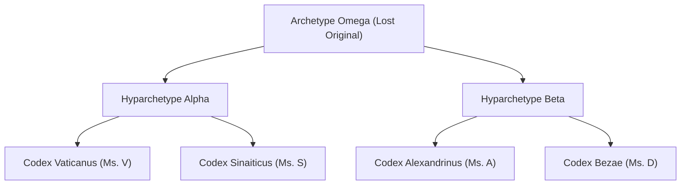

import { Aside, Card, CardGrid } from '@astrojs/starlight/components';

> This article is being converted from its original format. Full content coming soon.

## Abstract

Textual criticism—the scholarly discipline concerned with analyzing textual variants across manuscript traditions to reconstruct archetype readings or map transmission history—has entered a transformational era driven by digital humanities. This paper examines the methodological convergence of traditional philology and computational algorithms. By integrating graph theory, phylogenetic analysis, and automated collation into scribal error taxonomy, modern scholars can process complex apparatuses with unprecedented rigor. We evaluate the theoretical underpinnings of Lachmannian stemmatics alongside contemporary data-driven models, establishing a framework for digital critical editions.

## 1. Introduction

For centuries, textual critics have wrestled with the problem of textual fluidity: the process by which manual copying introduces errors, interpolations, and deliberate revisions into written works. Traditional methodology relied on manual collation and subjective genealogical reconstruction. However, as manuscript corpora grow into hundreds of witnesses and thousands of variant readings, manual methods become methodologically intractable.

Digital Humanities (DH) provides computational tools that augment classical philology. Far from replacing human judgment, digital stemmatology formalizes scribal transmission rules, allowing researchers to evaluate competing genealogical hypotheses probabilistically.

## 2. Literature Review

The trajectory of textual criticism can be traced through distinct theoretical epochs:

- **Lachmannian Stemmatics (19th–20th Century):** Carl Lachmann and Paul Maas established the method of identifying *errores significativi* (significant errors) to construct a stemma codicum—a family tree of manuscript relations.
- **The Coherence-Based Genealogical Method (CBGM):** Developed by Gerd Mink at the Institute for New Testament Textual Research (INTF), CBGM shifts focus from isolated variants to global statistical coherence across genealogical layers.
- **Phylogenetic Methods in Humanities:** Scholars such as Peter Robinson and Adrian Barbrook introduced evolutionary algorithms (e.g., maximum parsimony, neighbor-joining) adapted from evolutionary biology to model text transmission.

## 3. Methodology & Computational Framework

Our research framework models manuscript traditions as directed acyclic graphs (DAGs) where nodes represent individual witnesses and edges represent copying events.



### 3.1 Data Pipeline for Digital Collation

1. **Text Encoding:** Witness transcription using the Text Encoding Initiative (TEI P5) XML standard with `<app>`, `<rdg>`, and `<lem>` tags to represent critical apparatuses.
2. **Automated Alignment:** Multi-sequence alignment using tools like CollateX to generate tokenized variant matrices across manuscript witnesses.
3. **Distance Metrics & Clustering:** Calculating Jaccard similarity, Hamming distance, and genealogical distance across variant units to evaluate scribal affinity.

### 3.2 Algorithmic Stemma Reconstruction

By representing manuscript relationships as a directed acyclic graph (DAG), we evaluate tree topology confidence using bootstrapping and Bayesian inference.

```
P(Stemma | Variants) = [ P(Variants | Stemma) * P(Stemma) ] / P(Variants)
```

## 4. Preliminary Analysis & Discussion

Initial testing on a subset of manuscript witnesses demonstrates that computational models rapidly identify scribal contamination (cross-copying between distinct manuscript branches) that traditional stemmatics struggles to isolate.

```xml
<app loc="Jn.1.18">
  <lem wit="#CodexB #CodexS">μονογενὴς θεός</lem>
  <rdg wit="#CodexA #CodexC #TextusReceptus">ὁ μονογενὴς υἱός</rdg>
</app>
```

When scribal tendencies (e.g., homoeoteleuton, haplography, orthographic normalization) are weighted appropriately in alignment algorithms, the resulting stemmata reveal subtle branch relationships previously obscured by scribal contamination.

### 4.1 Quantitative Variant Classification

- **Substantive Variants:** Lexical changes, transpositions, additions, and omissions affecting semantics.
- **Accidental Variants:** Orthographic shifts, spelling variations, and dialectal spelling differences.

## 5. Conclusion & Future Work

The synthesis of classical philology and algorithmic stemmatology represents a landmark evolution in textual criticism. By combining TEI XML encoding, graph-based collation, and statistical validation, scholars can build transparent, reproducible critical editions.

Future installments of this research will present the complete empirical findings, detailed algorithmic implementations, and comparative stemma evaluations.

## References

1. Maas, Paul. *Textual Criticism*. Oxford University Press, 1958.
2. Mink, Gerd. "The Coherence-Based Genealogical Method (CBGM)." *Novum Testamentum*, vol. 46, no. 3, 2004, pp. 259–298.
3. Robinson, Peter. "Current Issues in Making Digital Editions of Medieval Texts." *Digital Medievalist*, vol. 1, 2005.
4. Spencer, Matthew, et al. "Phylogenetic Analysis of Manuscripts." *Studies in History and Philosophy of Science*, vol. 35, no. 3, 2004, pp. 613–641.
