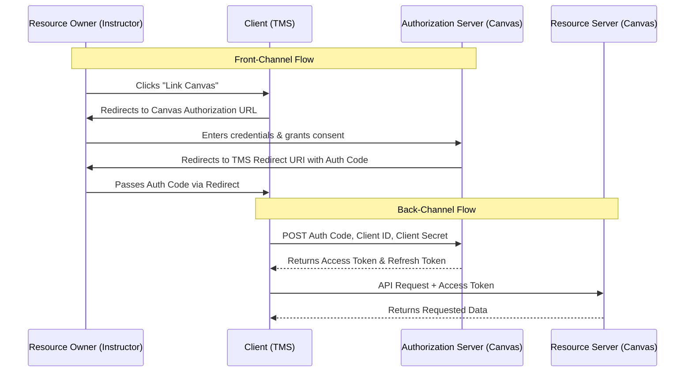

import { Aside } from '@astrojs/starlight/components';

<Aside type="note" title="Portfolio Context">
This documentation captures the internal architecture and developer runbooks for an academic evaluation system maintained by a university department. It has been genericized (e.g., renamed to "TMS") and published here to demonstrate technical writing and system architecture design. There are no proprietary IP or NDA encumbrances.
</Aside>

## Overview

The OAuth 2.0 protocol provides a secure mechanism for a Team Management System (TMS) to access user information stored in Canvas LMS without requiring the user to share their Canvas credentials directly. 

When an instructor links their TMS account with Canvas, they are redirected to the Canvas SSO login page. Upon successful authentication and consent, TMS is granted authorized access to the instructor's Canvas data. This linked state enables core integrations, such as importing student rosters and exporting peer evaluation scores seamlessly.

---

## Terminology Reference

Understanding OAuth 2.0 requires defining the specific roles each system component plays. In the context of the TMS integration:

- **Resource Owner**: The end-user (e.g., the instructor) who grants access to their data.
- **Client**: The application requesting access to the user's information. **TMS** acts as the client.
- **Authorization Server**: The system that authenticates the user and issues access tokens. **Canvas LMS** acts as the authorization server.
- **Authorization Grant**: A credential representing the resource owner's consent. The client exchanges this grant with the authorization server for an access token.
- **Access Token (Bearer Token)**: The secure key used by the client to access protected resources.
- **Resource Server**: The system hosting the protected user accounts and information. It verifies the access token before responding to requests.
- **Redirect URI**: The pre-registered destination where the authorization server sends the user after granting consent.
- **Scope**: The specific permissions granted by the end-user. For TMS, scopes include reading course lists, fetching enrollments, and managing group categories.
- **Client ID & Client Secret**: The unique credentials used to identify and authenticate the client (TMS) to the authorization server.

---

## Authorization Code Flow

TMS implements the **Authorization Code Flow**, which is the most common and secure OAuth 2.0 flow for server-side applications. The process is divided into front-channel (browser-based) and back-channel (server-to-server) communications.

### Sequence Diagram

### 1. Front-Channel Operations
1. The instructor initiates the flow by navigating to their TMS profile and clicking "Link Canvas".
2. TMS redirects the instructor's browser to the Canvas authorization endpoint, providing the `client_id`, `redirect_uri`, requested `scopes`, and a response type.
3. The instructor logs into Canvas and is prompted to authorize TMS.
4. Upon consent, Canvas redirects the instructor back to the TMS `redirect_uri` (the profile page), appending a temporary **authorization grant code** to the URL.

### 2. Back-Channel Operations
1. TMS extracts the authorization grant code and securely sends a background POST request to Canvas, including the code, `client_id`, and `client_secret`.
2. Canvas validates the credentials and returns an **access token** and a **refresh token**.
3. TMS stores these tokens securely and utilizes the access token in the `Authorization` header of subsequent API requests to the Canvas Resource Server.

---

## Codebase Implementation

The following details the internal Perl architecture handling the integration. Modules are primarily located within `TMS-Web/tms-lib/lib/LMS/`.

### Linking the Account
When an instructor initiates the link, `my_profile` triggers `Login::get_auth()`, which delegates to `Canvas::get_auth()`. This function constructs the authorization URL. After the redirect, `my_profile` extracts the payload and persists the `person_id`, `access_token`, `refresh_token`, and token expiration time into the `canvas_tokens` database table.

Conversely, unlinking the account simply drops the associated row from `canvas_tokens`.

### Importing Data
TMS pulls data from Canvas for different operational contexts:

- **Team Maker Surveys (`sw40_students`)**: The system calls `Canvas::get_all_students_in_course()`, passing the active access token. Canvas defaults to paginated responses (10 items per page). The module utilizes a `while` loop to traverse pagination links and aggregate the complete roster.
- **Peer Evaluation Surveys**: The system fetches group categories (`Canvas::get_group_categories()`), specific groups (`Canvas::get_groups()`), and the students within those groups (`Canvas::get_group_users()`). This maps Canvas group structures directly to TMS teams.

### Exporting Data
Once teams are formed or evaluations are graded, data is pushed back to Canvas:

- **Exporting Groups (`tm_display_results`)**: The system verifies the target course via `Canvas::get_course_list()`. It fetches existing group categories and deletes any that conflict with the current activity name. It then provisions a new group category (`Canvas::create_group_category()`), creates individual groups (`Canvas::create_group()`), and populates them with students.
- **Exporting Grades**: TMS ensures the target assignment does not conflict with existing ones. The system calculates final grades (including any instructor-defined adjustment factors) and posts them to the Canvas gradebook using `Canvas::grade_student_assignment()`.

### Token Refresh Lifecycle
Access tokens possess a limited lifespan. Before making API calls, `Canvas::check_and_update_token()` validates the token's temporal validity:
1. It retrieves the expiration timestamp from the database.
2. If the current time is within one minute of expiration (or past it), it issues a refresh request using the stored `refresh_token`.
3. Upon success, the new `access_token` and updated expiration timestamp are persisted to the database.
