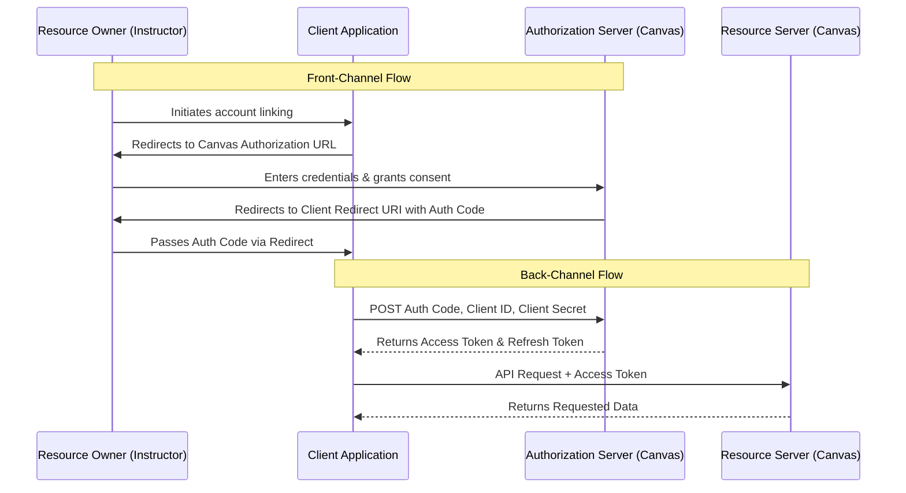

import { Aside } from '@astrojs/starlight/components';

<Aside type="note" title="Portfolio Context">
This documentation captures the internal architecture and developer runbooks for an academic evaluation system. It has been genericized and published here to demonstrate technical writing, system architecture design, and Developer Experience (DevEx) engineering. There are no proprietary IP or NDA encumbrances.
</Aside>

The OAuth 2.0 protocol provides a secure mechanism for a third-party application (the Client) to access user information stored in Canvas LMS without requiring the user to share their Canvas credentials directly. 

When an instructor links their account with a third-party application, they are redirected to the Canvas SSO login page. Upon successful authentication and consent, the application is granted authorized access to the instructor's Canvas data. This linked state enables core integrations, such as importing student rosters and exporting grades seamlessly.

---

## Terminology Reference

Understanding OAuth 2.0 requires defining the specific roles each system component plays:

- **Resource Owner**: The end-user (for example, the instructor) who grants access to their data.
- **Client**: Your application requesting access to the user's information.
- **Authorization Server**: The system that authenticates the user and issues access tokens. **Canvas LMS** acts as the authorization server.
- **Authorization Grant**: A credential representing the resource owner's consent. The client exchanges this grant with the authorization server for an access token.
- **Access Token (Bearer Token)**: The secure key used by the client to access protected resources.
- **Resource Server**: The system hosting the protected user accounts and information. It verifies the access token before responding to requests.
- **Redirect URI**: The pre-registered destination where the authorization server sends the user after granting consent.
- **Scope**: The specific permissions granted by the end-user (for example, reading course lists, fetching enrollments).
- **Client ID & Client Secret**: The unique credentials used to identify and authenticate your application to the authorization server.

---

## Authorization Code Flow

Canvas LMS implements the **Authorization Code Flow**, which is the most common and secure OAuth 2.0 flow for server-side applications. The process is divided into front-channel (browser-based) and back-channel (server-to-server) communications.

### Sequence Diagram



### 1. Requesting User Consent (Front-Channel)

To begin the flow, your application redirects the user's browser to the Canvas authorization endpoint:
`GET https://<canvas-instance>/login/oauth2/auth`

Include the following query parameters:
- `client_id`: Your application's unique ID.
- `response_type`: Set to `code`.
- `redirect_uri`: The endpoint in your application that will handle the callback.
- `scope`: (Optional) A space-separated list of required scopes.

The user logs into Canvas and is prompted to authorize the application. Upon consent, Canvas redirects the user back to the `redirect_uri`, appending a temporary **authorization code** to the URL query string (`?code=...`).

### 2. Exchanging the Code for a Token (Back-Channel)

Your application extracts the authorization code and securely sends a background POST request to the Canvas token endpoint:
`POST https://<canvas-instance>/login/oauth2/token`

Include the following URL‑encoded form data (not JSON):

- `grant_type=authorization_code`
- `client_id=YOUR_CLIENT_ID`
- `client_secret=YOUR_CLIENT_SECRET`
- `redirect_uri=YOUR_REDIRECT_URI`
- `code=AUTHORIZATION_CODE_FROM_REDIRECT`

> **Note:** Replace `<canvas-instance>` throughout this guide with the actual domain of your Canvas LMS instance (for example, `canvas.instructure.com`).

Canvas validates the credentials and returns a JSON response containing the `access_token`, a `refresh_token`, and the `expires_in` duration (typically 3600 seconds).

### 3. Making Authenticated API Requests

Your application stores these tokens securely and utilizes the `access_token` in the `Authorization` header of subsequent API requests to the Canvas Resource Server.

```http
GET /api/v1/courses HTTP/1.1
Host: <canvas-instance>
Authorization: Bearer <access_token>
```

### 4. Refreshing Expired Tokens

Access tokens possess a limited lifespan. Before making API calls, your application should validate the token's temporal validity. If the token is expired, issue a refresh request to the token endpoint:
`POST https://<canvas-instance>/login/oauth2/token`

Include the following payload:
- `grant_type`: Set to `refresh_token`.
- `client_id`: Your application's unique ID.
- `client_secret`: Your application's secure secret key.
- `refresh_token`: The refresh token received in step 2.

Upon success, the new `access_token` and updated expiration timestamp should be persisted to your database.

---

## Example HTTP Request (cURL)

To execute the back-channel token exchange, you can make a standard POST request to the token endpoint. 

Because the OAuth 2.0 specification requires token requests to be formatted as form data (rather than JSON), ensure you use the `-d` flag in your `curl` command to send the payload as `application/x-www-form-urlencoded`.

```bash
curl -X POST https://canvas.instructure.com/login/oauth2/token \
  -H "Content-Type: application/x-www-form-urlencoded" \
  -d "grant_type=authorization_code" \
  -d "client_id=YOUR_CLIENT_ID" \
  -d "client_secret=YOUR_CLIENT_SECRET" \
  -d "redirect_uri=https://api.your-app.com/oauth/callback" \
  -d "code=AUTHORIZATION_CODE_FROM_REDIRECT"
```

**Example Response:**

```json
{
  "access_token": "8489~TOKEN_STRING,"
  "token_type": "Bearer,"
  "user": {
    "id": 12345,
    "name": "Jane Doe"
  },
  "refresh_token": "8489~REFRESH_TOKEN_STRING,"
  "expires_in": 3600
}
```
