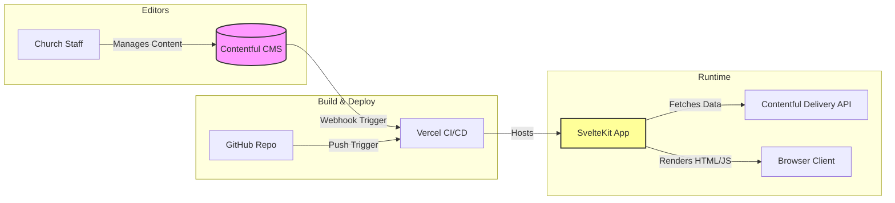

import { Aside, Steps, Tabs, TabItem } from '@astrojs/starlight/components';

The Raised Church website employs a decoupled Jamstack architecture. The frontend is built with **SvelteKit**, which consumes structured content via the **Contentful Delivery API (RESTful/GraphQL)**. This approach ensures that the frontend presentation is entirely separate from content management.

## System Overview



## SvelteKit File-Based Routing

SvelteKit uses filesystem-based routing. The directory structure in `src/routes` defines the URL structure of the application.

```text
src/routes/
├── +layout.svelte       # Global layout (Navbar, Footer, Language Context)
├── +layout.server.ts    # Global data fetching (e.g., site settings)
├── +page.svelte         # Homepage component
├── +page.server.ts      # Homepage data loading (fetches featured events)
├── sermons/
│   ├── +page.svelte     # Sermon listing page
│   ├── +page.server.ts  # Fetches all sermons from Contentful
│   └── [slug]/          # Dynamic route for individual sermons
│       ├── +page.svelte
│       └── +page.server.ts # Fetches specific sermon by slug
├── events/
│   └── ...
└── about/
    └── ...
```

### Data Loading Pattern

We exclusively use server-side data loading (`+page.server.ts`) to fetch data from Contentful before rendering the page. This ensures API keys remain secure on the server and that the client receives fully hydrated HTML, which is critical for SEO.

```typescript
// src/routes/sermons/+page.server.ts
import { contentfulClient } from '$lib/server/contentful';
import type { PageServerLoad } from './$types';

export const load: PageServerLoad = async ({ locals }) => {
    // `locals.locale` is set via middleware based on the user's language preference
    const locale = locals.locale === 'zh' ? 'zh-Hant-TW' : 'en-US';

    const response = await contentfulClient.getEntries({
        content_type: 'sermon',
        order: ['-fields.date'], // Order by date descending
        locale: locale
    });

    return {
        sermons: response.items
    };
};
```

## Contentful Data Model

The content model in Contentful is strictly typed to ensure data consistency. We define specific Content Types that map to UI components.

### Core Content Types

1. **Sermon (`sermon`)**
   - `title` (Symbol): Bilingual title.
   - `slug` (Symbol): URL-friendly identifier.
   - `date` (Date): When the sermon was preached.
   - `speaker` (Reference): Link to a `Person` entry.
   - `youtubeId` (Symbol): The 11-character YouTube video ID for embedding.
   - `passage` (Symbol): Bible verses covered (e.g., "John 3:16-21").
   - `summary` (Rich Text): Bilingual summary of the sermon.

2. **Event (`event`)**
   - `title`, `description`, `startDate`, `endDate`, `location`, `coverImage`.

3. **Person (`person`)**
   - `name`, `role` (e.g., "Senior Pastor"), `bio`, `profilePicture`.

4. **Page Content (`page`)**
   - Used for static pages like "About Us" or "Gathering Times".
   - `pageId` (Symbol): Identifier (e.g., "about-page").
   - `content` (Rich Text): The main body content.

<Aside type="tip">
By keeping references normalized (e.g., `Sermon` references `Person`), updating a pastor's title updates it automatically across all past sermons they've preached.
</Aside>

## Bilingual Implementation

Handling bilingual content effectively was a primary architectural requirement.

We utilize Contentful's native localization features. Every field in Contentful is configured to accept both `en-US` (English) and `zh-Hant-TW` (Traditional Chinese) values. 

In SvelteKit, the user's language preference is stored in a cookie. A `hooks.server.ts` middleware intercepts every request, reads the cookie, and attaches the locale to the `event.locals` object. Load functions then pass this locale directly to the Contentful API, which returns only the localized strings.

This means our Svelte components do not need complex i18n dictionaries for Contentful data; they simply render the string they are given.

```svelte
<!-- src/routes/sermons/+page.svelte -->
<script lang="ts">
    export let data;
</script>

<h1>{data.dictionary.sermonArchive}</h1> <!-- Static UI string from i18n store -->

<ul>
    {#each data.sermons as sermon}
        <li>
            <!-- The title is already in the correct language based on the server fetch -->
            <h2>{sermon.fields.title}</h2> 
            <p>{sermon.fields.date} - {sermon.fields.speaker.fields.name}</p>
        </li>
    {/each}
</ul>
```
