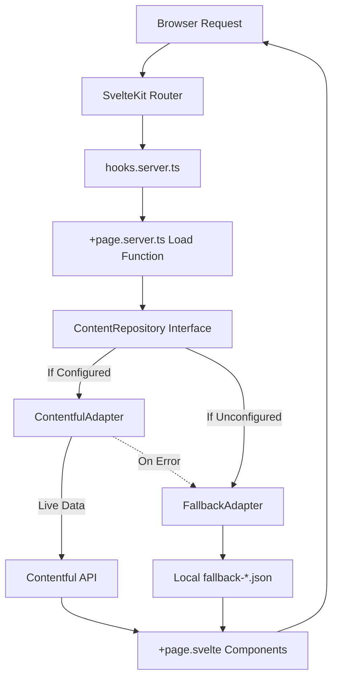

import { Aside } from '@astrojs/starlight/components';

This guide explains the architectural decisions, request lifecycle, and data flow of the Raised Church website. The system is designed to provide a fast, bilingual experience backed by a headless CMS, with a robust fallback mechanism.

## System overview

The architecture separates the frontend presentation from the content data source using a repository pattern. Here is the high-level data flow:



## Request lifecycle

When a user visits a page, the request goes through several layers before the browser renders the HTML.

1. **Language and site detection (`hooks.server.ts`):** 
   The hook inspects the URL to detect the requested language (`/en` or `/zh`). It also examines the hostname to resolve the correct site profile config (e.g., identity, theme colors).
2. **Layout data loading (`+layout.server.ts`):** 
   Global data like site configuration, contact information, and active news banners are fetched here so they are available to all child routes.
3. **Page data loading (`+page.server.ts`):** 
   Route-specific load functions call the `ContentRepository` to fetch data required for that specific page (e.g., sermons or activities).
4. **Server-Side Rendering (SSR):** 
   SvelteKit compiles the components and data into HTML on the server.
5. **Client hydration:** 
   The HTML is sent to the browser, and SvelteKit hydrates the page to enable client-side routing and reactivity.

## The ContentRepository pattern

To abstract the data source from the UI components, the project uses the `ContentRepository` interface. You access data by calling `getContentRepository()` in your server load functions.

This pattern exists to provide **graceful degradation** and to enable **development without CMS credentials**.

- **ContentfulAdapter:** This adapter queries the live Contentful SDK. If it encounters any network or API error, it catches the error and delegates the call to the `FallbackAdapter`.
- **FallbackAdapter:** This adapter reads static JSON files located in `src/lib/data/`. It requires no network requests and ensures the site always builds and renders successfully, even if the CMS is completely down or unconfigured.

<Aside type="tip">
You should never import `ContentfulAdapter` or `FallbackAdapter` directly into your routes. Always use the `getContentRepository()` factory function.
</Aside>

## SvelteKit routing structure

The app uses SvelteKit's file-based routing. The `src/routes/[[lang]]/` structure allows the language parameter to be optional. 

- `+page.server.ts`: Responsible for fetching data on the server.
- `+page.svelte`: Responsible for rendering the UI using the data provided.

## Multi-church architecture

The system is designed to host multiple church websites from a single codebase.

In `hooks.server.ts`, the application matches the incoming request's hostname against site profiles defined in `src/lib/config/site.ts` (or files in a `sites/` directory). This runtime configuration resolution injects the correct identity, theme colors, and layout settings into the request locals, which are then passed down to the components.

## Data flow in Svelte 5 components

Data loaded on the server is passed to your components via props. You must use Svelte 5 runes to receive and process this data.

Here is an example of how data flows into a page component:

```svelte
<script lang="ts">
  import { page } from "$app/state";
  import { getTranslation, getLangFromParams } from "$lib/i18n";
  import HeroSlider from "$lib/components/HeroSlider.svelte";

  // Receive data from +page.server.ts
  let { data } = $props();

  // Derive localized strings based on the current URL
  let lang = $derived(getLangFromParams(page.params));
  let t = $derived(getTranslation(lang));
</script>

<h1>{t.pages.home.title}</h1>

<!-- Pass data down to child components -->
<HeroSlider slides={data.heroSlides} {lang} />
```

<Aside type="danger">
The project uses Svelte 5 strictly. Never use `export let data` or `\$: ` reactive statements. Always use `$props()`, `$state()`, and `$derived()`.
</Aside>
