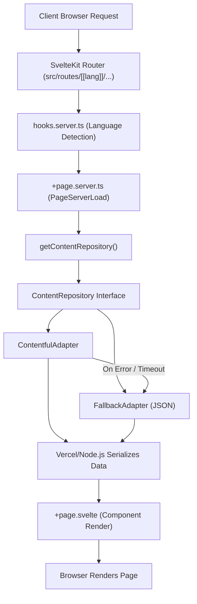

import { Aside } from '@astrojs/starlight/components';

This document provides a theoretical overview of the `svelte-raised-church` data flow and component hierarchy. It is intended for system architects and senior engineers seeking to understand how the SvelteKit request lifecycle interacts with our headless Contentful CMS pipeline.

---

## High-Level Data Flow

The following diagram illustrates the complete request-response cycle, highlighting our resilient fallback architecture that ensures the site remains operational even during CMS outages.



---

## Request Lifecycle Example: Home Page (`/en`)

### 1. URL Request

```
GET /en HTTP/1.1
```

### 2. Language Detection (hooks.server.ts)

```typescript
const match = event.url.pathname.match(/^\/(en|zh)(?:\/|$)/);
const lang = match ? match[1] : "zh-Hant";
event.locals.lang = lang;
```

### 3. Load Data (routes/[[lang]]/+page.server.ts)

```typescript
export const load: PageServerLoad = async ({ params }) => {
  return getContentRepository().fetchHomePage(params.lang as "en" | "zh" | undefined);
};
```

### 4. Fetch from CMS (ContentfulAdapter / FallbackAdapter)

```typescript
// ContentfulAdapter delegates to FallbackAdapter on error:
async fetchHomePage(lang) {
  return this.withFallback("homePage," lang,
    async () => {
      const entries = await contentfulClient.getEntries({
        content_type: "homePage,"
        locale: getLocale(lang), // en-US or zh-Hant-TW
      });
      return { heroSlides: [...], gatheringTimes: [...] };
    },
    () => this.fallback.fetchHomePage(lang), // FallbackAdapter
  );
}
```

### 5. Render Component (routes/[[lang]]/+page.svelte)

```svelte
<script lang="ts">
  import { page } from "$app/state";
  import { getTranslation, getLangFromParams } from "$lib/i18n";

  let { data } = $props(); // Receives { heroSlides, gatheringTimes, newsBanner }
  let t = $derived(getTranslation(getLangFromParams(page.params)));
</script>

<!-- Render with translations -->
<HeroSlider slides={data.heroSlides} lang={page.params.lang} />
```

---

## File Organization

### Routes Structure

```
src/routes/
└── [[lang]]/              # Optional language parameter
    ├── +page.svelte       # Home page (renders)
    ├── +page.server.ts    # Home page (loads data)
    ├── +layout.svelte     # Layout wrapper
    ├── about/
    │   ├── +page.svelte
    │   └── +page.server.ts
    ├── activities/
    ├── events/               # News and upcoming events
    ├── messages/
    ├── sharing/
    ├── offering/
    └── training/
```

### Library Structure

```
src/lib/
├── components/            # Reusable UI components
│   ├── ContactForm.svelte # Takes explicit props (mapEmbedUrl, phone, etc.)
│   ├── Navbar.svelte
│   ├── Footer.svelte
│   └── ...
├── server/                # Server-only code
│   ├── contentful.ts          # CMS client + isContentfulConfigured
│   ├── content-repository.ts  # ContentRepository interface + getContentRepository()
│   ├── contentful-adapter.ts  # Adapter: Contentful SDK calls
│   └── fallback-adapter.ts    # Adapter: static JSON fallback
├── config/
│   └── env.ts             # SITE_URL from PUBLIC_SITE_URL env var
├── types/
│   └── contentful.ts      # Content type interfaces (Language re-exported from i18n)
├── i18n/
│   └── index.ts           # Language type, translations, localizePath, useLang()
├── utils/
│   └── logger.ts          # Structured logging
└── data/                  # Fallback JSON (used by FallbackAdapter)
    ├── fallback-activities.json
    ├── fallback-sermons.json
    └── ...
```

---

## Component Hierarchy

### Top-Level Layout

```
_layout.svelte (Navigation, Footer)
└── +page.svelte (Page-specific content)
    ├── PageHero (Page title section)
    ├── Breadcrumb (Navigation path)
    ├── [Page-specific components]
    └── ContactForm / ServicesGrid / etc.
```

### Component Communication

- **Props Down:** Parent passes data to children
- **Events Up:** Children emit events to parents
- **State:** `let x = $state()` for mutable state
- **Reactive:** `let y = $derived(computedValue)` for derived values

---

## Content Types & Page Mapping

| Page       | Route         | Content Types                           | Fallback                 |
| ---------- | ------------- | ----------------------------------------- | ------------------------ |
| Home       | `/`           | `homePage`, `gatheringTime`, `newsBanner` | fallback-home.json       |
| About      | `/about`      | `aboutPage`                               | fallback-about.json      |
| Events     | `/events`     | `churchNews`                              | fallback-church-news.json|
| Activities | `/activities` | `activity`                                | fallback-activities.json |
| Messages   | `/messages`   | `sermon`                                  | fallback-sermons.json    |
| Sharing    | `/sharing`    | `sharing`                                 | fallback-sharings.json   |
| Offering   | `/offering`   | `offering`                                | fallback-offering.json   |
| Training   | `/training`   | `trainingResource`                        | fallback-training.json   |

---

## Language Routing

### URL Patterns

- `/` → Chinese (default)
- `/zh/...` → Chinese (explicit)
- `/en/...` → English

### Language Detection

1. Read URL first part: `/en` or `/zh`
2. If not present, default to Chinese (`zh-Hant`)
3. Pass to Contentful queries as locale: `en-US` or `zh-Hant-TW`

### Adding New Language

1. Add entry to `translations` in `src/lib/i18n/index.ts`
2. Update `getLocale()` in `src/lib/server/contentful-adapter.ts`
3. Update `Language` type in `src/lib/i18n/index.ts`

---

## Data Fetching Strategy

### ContentRepository seam

All data fetching goes through the `ContentRepository` interface (`src/lib/server/content-repository.ts`). Call `getContentRepository()` in any `+page.server.ts` to get the right adapter:

```typescript
import { getContentRepository } from "$lib/server/content-repository";

export const load: PageServerLoad = async ({ params }) => {
  const items = await getContentRepository().fetchActivities(params.lang as "en" | "zh" | undefined);
  return { items };
};
```

- **`ContentfulAdapter`**—used when `CONTENTFUL_SPACE_ID` + `CONTENTFUL_ACCESS_TOKEN` are set. Falls back to `FallbackAdapter` on any error.
- **`FallbackAdapter`**—always used when Contentful is not configured; reads the static JSON files in `src/lib/data/`.

### Error Handling

The `ContentfulAdapter` catches all errors internally and delegates to `FallbackAdapter`. Routes never need try/catch.

---

## Type System

### Contentful Types (src/lib/types/contentful.ts)

```typescript
// What Contentful returns (raw)
export interface ContentfulActivity {
  fields: {
    title: string;
    description: string;
    images?: ContentfulAsset[];
  };
}

// What app uses (clean)
export interface Activity {
  title: string;
  description: string;
  images: string[];
}
```

### Type Flow

```
Contentful Response (raw)
    ↓
Map using ContentfulActivity interface
    ↓
Transform to Activity interface
    ↓
Pass to component with Activity type
    ↓
TypeScript enforces properties
```

---

## Key Decisions

### Why SvelteKit?

- Built-in routing and SSR
- Excellent TypeScript support
- File-based routing (intuitive)
- Small bundle size

### Why Contentful?

- Headless CMS (no lock-in)
- Multilingual out of the box
- RESTful API (easy to query)
- Free tier sufficient for church site

### Why Fallback Data?

- Site works without Contentful
- Development without API keys
- Graceful degradation in outages

### Why Vercel?

- SvelteKit native support
- Serverless functions included
- Automatic deployments on git push
- Easy environment variable management

---

## Adding a New Page

### Step 1: Create Route Directory

```
src/routes/[[lang]]/mypage/
├── +page.svelte
└── +page.server.ts
```

### Step 2: Define Contentful Content Type

Create content type `myPage` in your Contentful space.

### Step 3: Add Type Definition

```typescript
// src/lib/types/contentful.ts
export interface MyPage { ... }
export interface ContentfulMyPage { fields: { ... } }
```

### Step 4: Add Fetch Method to Both Adapters

Add `fetchMyPage(lang)` to the `ContentRepository` interface, then implement it in `ContentfulAdapter` and `FallbackAdapter`.

### Step 5: Create Load Function

```typescript
// src/routes/[[lang]]/mypage/+page.server.ts
import { getContentRepository } from "$lib/server/content-repository";
import type { PageServerLoad } from "./$types";

export const load: PageServerLoad = async ({ params }) => {
  return getContentRepository().fetchMyPage(params.lang as "en" | "zh" | undefined);
};
```

### Step 6: Create Component

```svelte
<script lang="ts">
  import { page } from "$app/state";
  import { getLangFromParams } from "$lib/i18n";

  let { data } = $props();
  let lang = $derived(getLangFromParams(page.params));
</script>
```

### Step 7: Add Translation Keys

```typescript
// src/lib/i18n/index.ts—add under pages: { ... }
mypage: { title: "My Page," subtitle: "Description" }
```

---

## Common Patterns

### Using Translations

```svelte
<h1>{t.pages.mypage.title}</h1>
```

### Using Date Formatting

```typescript
import { formatDate } from "$lib/i18n";
const formatted = formatDate("2025-12-01," lang);
```

### Conditionally Rendering Content

```svelte
{#if data.items && data.items.length > 0}
  {#each data.items as item}
    <Item {item} />
  {/each}
{:else}
  <p>{t.common.noItems}</p>
{/if}
```

### Using Responsive Breakpoints

```scss
@media (max-width: $breakpoint-tablet) {
  // Tablet styles
}
```

---

## Performance Considerations

- Images lazy-loaded except first slide
- Server-side data fetching reduces client JS
- Fallback data prevents waterfalls
- Contentful queries cached at request level

See `docs/PERFORMANCE.md` for optimization tips.
