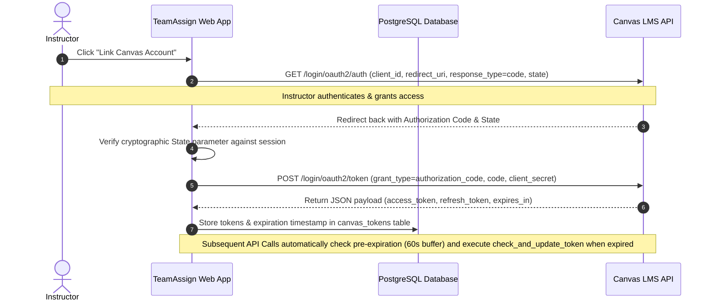
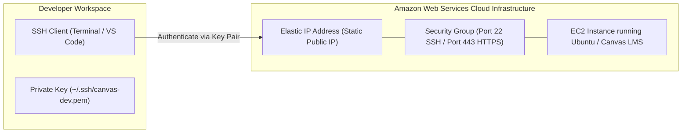

import { Aside } from '@astrojs/starlight/components';

<Aside type="note" title="Author's Institutional Knowledge Note">
This is a sanitized excerpt from a comprehensive onboarding guide I independently researched, tested, and authored over a 2-year period for a legacy Perl monolith with zero prior documentation. It demonstrates my ability to navigate unfamiliar codebases, document complex OAuth 2.0 flows, and build self-service developer resources.
</Aside>

This document outlines the architecture and backend implementation of TeamAssign’s **Canvas Learning Management System (LMS) Integration**, along with the operational workflows for provisioning and connecting to our **Amazon Web Services (AWS)** hosting infrastructure.

---

## About Canvas LMS Integration and OAuth 2.0

TeamAssign integrates directly with Canvas LMS to allow academic instructors to import course rosters, form optimized teams, and export final peer evaluation grades back to the Canvas gradebook.

### Overview & Core Terminology
To understand how TeamAssign communicates with Canvas, developers must be familiar with the following standard academic interoperability terms:
- **LMS (Learning Management System)**: The institution's primary software platform for delivering course content and grading (e.g., Canvas, Blackboard, Moodle).
- **LTI (Learning Tools Interoperability)**: A standard specification developed by 1EdTech that securely connects external learning applications (like TeamAssign) directly into an LMS course window.
- **SIS (Student Information System)**: The university's master registrar database containing official student IDs, course enrollments, and academic transcripts.
- **OAuth 2.0**: The industry-standard authorization framework used to grant TeamAssign secure, delegated access to perform actions on behalf of a Canvas user without ever storing their actual Canvas login password.
- **Client ID & Client Secret**: Unique cryptographic credentials assigned by an institution’s Canvas administrator to authenticate TeamAssign as an authorized API application.
- **Access Token & Refresh Token**: Cryptographic bearer tokens issued by Canvas after successful OAuth authorization. Access tokens expire periodically (typically every 1 hour), requiring the refresh token to silently request a new access token without interrupting the instructor's workflow.

---

## Authorization Code Flow 🔄

TeamAssign utilizes the secure **OAuth 2.0 Authorization Code Flow** (supplemented by state verification parameters) to establish API connections between our backend and an instructor's Canvas domain.



### 1. Authorization Request (`GET /login/oauth2/auth`)
When an instructor initiates Canvas linking, TeamAssign redirects their browser to the Canvas OAuth endpoint:
```http
GET https://<canvas_domain>/login/oauth2/auth?
  client_id=<TEAMASSIGN_CLIENT_ID>&
  response_type=code&
  redirect_uri=https://teamassign.org/app/lms/oauth_callback&
  state=<CSRF_STATE_TOKEN>
```

### 2. Token Exchange (`POST /login/oauth2/token`)
After the instructor approves access, Canvas redirects back to `/app/lms/oauth_callback` with an authorization `code`. TeamAssign validates the `state` parameter and POSTs the code to exchange it for bearer tokens:
```http
POST https://<canvas_domain>/login/oauth2/token
Content-Type: application/x-www-form-urlencoded

grant_type=authorization_code&
client_id=<TEAMASSIGN_CLIENT_ID>&
client_secret=<TEAMASSIGN_CLIENT_SECRET>&
redirect_uri=https://teamassign.org/app/lms/oauth_callback&
code=<AUTHORIZATION_CODE>
```

### 3. Database Persistence & Expiration Tracking
Upon a successful JSON response from Canvas, TeamAssign stores the resulting `access_token`, `refresh_token`, and calculated expiration timestamp directly inside our backend PostgreSQL database (`canvas_tokens` table).

---

## Source Code Architecture (`teamassign-lib`) 💻

Most of TeamAssign's core application logic is split between the primary web repository and the `teamassign-lib` submodule. All Canvas integration code is located inside `/var/www/src/teamassign-lib/lib/LMS/`:

| Perl Module | Path | Primary Responsibilities & Methods |
| :--- | :--- | :--- |
| **`Login.pm`** | `lib/LMS/Login.pm` | Handles the initial OAuth redirect requests, callback URL processing, `state` CSRF generation, and extracting the authorization `code` upon redirection. |
| **`Canvas.pm`** | `lib/LMS/Canvas.pm` | Implements direct HTTP client interactions against Canvas REST API endpoints (fetching courses, syncing student rosters, submitting peer evaluation gradebook entries). |
| **`Utils.pm`** | `lib/LMS/Utils.pm` | Provides critical utility helpers, including `check_and_update_token`. This method checks whether an access token is within 60 seconds of expiration; if expired, it automatically executes a refresh grant request to issue and persist a new access token before executing the API call. |
| **`LMS.pm`** | `lib/LMS/LMS.pm` | Acts as the universal abstract facade and factory module dispatching requests between different LMS implementations. |

<Aside type="note">
**Server Restart Requirement**: Because `teamassign-lib` is a compiled Perl library pre-loaded by `mod_perl` during server startup (`conf/startup.pl`), making edits to any file inside `lib/LMS/*.pm` requires running `make restart_httpd` inside `/var/www/src` on your developer VM to see your changes applied.
</Aside>

---

## Navigating AWS (Amazon Web Services) ☁️

TeamAssign relies on Amazon Web Services to host both our remote developer virtual machines (`*.teamassign.org`) and isolated Canvas LMS testing environments.



### 1. What is AWS & Account Access
Amazon Web Services provides virtualized cloud computing resources. Developers who need to configure standalone Canvas LMS test server instances require access to our internal AWS IAM console. If assigned to an infrastructure project, contact your supervisor to receive your AWS IAM credentials.

### 2. Launching an AWS Instance to Host Canvas LMS
When provisioning a new testing server for Canvas integration:
1. Log into the AWS Management Console and navigate to the **EC2 Dashboard**.
2. Click **Launch Instance** and select an **Ubuntu Server** Amazon Machine Image (AMI).
3. Choose an instance type appropriate for Canvas LMS requirements (e.g., `t3.large` or `m5.large`).
4. Configure storage and security groups, ensuring port `22` (SSH) is restricted to developer IPs and port `443` (HTTPS) is open for LTI callbacks.

### 3. Creating & Managing Key Pairs 🔐
To SSH into your newly launched EC2 instance securely:
1. Under **Key Pair (login)** during instance launch, select **Create new key pair**.
2. Name the key pair (e.g., `canvas-test-key`) and select **RSA** and `.pem` format.
3. Download the `.pem` file to your local `~/.ssh/` directory immediately (AWS only allows downloading the private key once).
4. Restrict permissions on the private key file immediately so your SSH client does not reject it as insecure:
   ```bash
   chmod 400 ~/.ssh/canvas-test-key.pem
   ```

### 4. Allocating an Elastic IP & Connecting
Because standard EC2 instances change public IP addresses upon reboot, allocate an **Elastic IP Address** under the EC2 network settings and associate it with your running Canvas instance to ensure a static endpoint for OAuth redirect URIs.

Connect to your AWS instance via terminal:
```bash
# Connect using your downloaded private key (.pem)
ssh -i ~/.ssh/canvas-test-key.pem ubuntu@<elastic_ip_address>
```

### 5. SSH Access Without a Key-Pair File
If an AWS instance was previously launched and you need access but do not possess the original `.pem` key pair:
1. Contact an existing developer or system administrator who currently has root/sudo access on that EC2 instance.
2. Provide them with your public SSH key (`~/.ssh/id_ed25519.pub`).
3. Have them append your public key directly into `/home/ubuntu/.ssh/authorized_keys` (or `/root/.ssh/authorized_keys`) on the remote server. Once added, you can connect immediately using your standard local SSH identity without needing the original `.pem` file.
