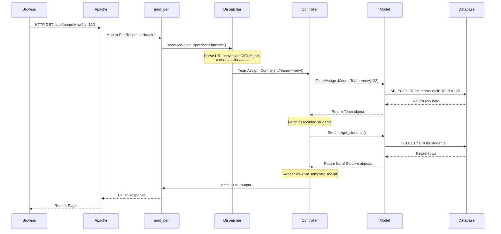
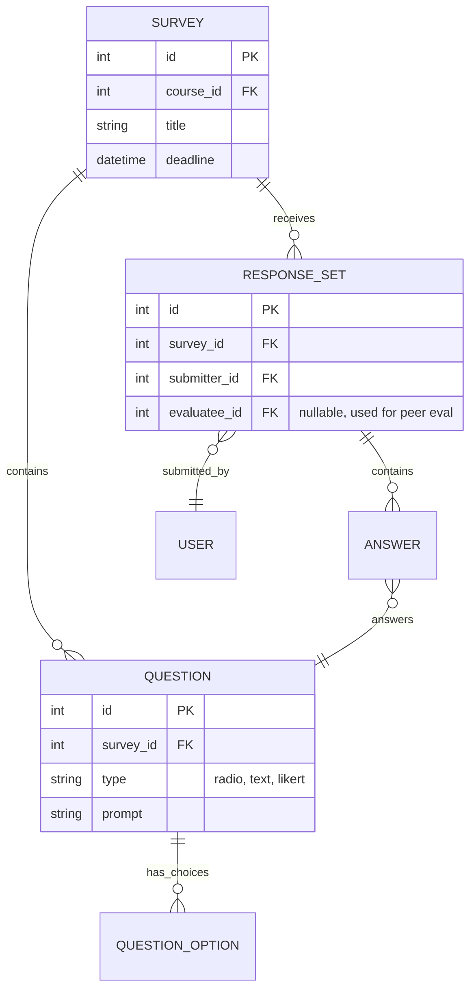

import { Aside } from '@astrojs/starlight/components';

TeamAssign utilizes a robust, traditional Model-View-Controller (MVC) architecture adapted for the `mod_perl` environment. Understanding the request lifecycle and data flow is essential for navigating the legacy codebase effectively.

## Request Lifecycle

Because TeamAssign runs under Apache's `mod_perl2`, the Perl interpreter is persistent in memory. This eliminates the overhead of starting a new Perl process for every request (as in standard CGI), but requires careful management of global variables and memory.



## Module & Multi-Repository Organization

The TeamAssign platform is distributed across two primary Git repositories that separate core platform controllers/views from shared backend library code:
1. **`TeamAssign` (Main Web Repository)**: Contains the CGI scripts, Apache/mod_perl dispatcher configuration (`htdocs/`, `conf/`), Template Toolkit HTML presentation files (`templates/`), and frontend controllers.
2. **`teamassign-lib` (Submodule & Core Engine)**: Contains all backend data access models, algorithmic constraint solvers, and third-party integration drivers under `lib/`.

### Core Namespace Architecture (`lib/TeamAssign/` & `lib/LMS/`)

```
teamassign-lib/lib/
├── TeamAssign/
│   ├── Dispatcher.pm   # Central URI router, session check, and mod_perl handler
│   ├── Controller/     # Domain business logic (Teams.pm, Surveys.pm, Auth.pm)
│   ├── Model/          # Blessed hash object models & DBI access (User.pm, Course.pm)
│   ├── View/           # Template Toolkit presentation wrapper & global contexts
│   └── Utils/          # Helper utilities (CSV parser, mailer, date formatting)
└── LMS/
    ├── LMS.pm          # Common interface for Learning Management System providers
    ├── Login.pm        # OAuth 2.0 PKCE / Authorization code handshake & refresh
    ├── Canvas.pm       # Canvas LMS REST API client (SIS imports, roster sync)
    └── Utils.pm        # API request formatting, user-agent headers, and logging
```

- **`Dispatcher.pm`**: The central entry point for `mod_perl`. Maps URLs to specific Controller modules and subroutines. Handles global setup, logging initialization, and session validation.
- **`Controller/`**: Contains the business logic for specific domains (`Teams.pm`, `Surveys.pm`, `Auth.pm`). Controllers parse input, interact with Models, and prepare data for the view layer.
- **`Model/`**: Encapsulates data access. Each major database entity has a corresponding Model class (`User.pm`, `Course.pm`, `Team.pm`). These classes abstract raw SQL queries using parameterized `DBI` placeholders.
- **`LMS/` Subsystem**: Dedicated integration hierarchy where `Login.pm` and `Canvas.pm` handle external OAuth 2.0 token persistence (`canvas_tokens` table) and automatic pre-expiration token refreshes (`check_and_update_token`) prior to any roster synchronization.

## Database Schema Patterns

The MySQL database is highly relational. We prioritize foreign keys and constraints to maintain data integrity across thousands of courses.

### Core Tables

- **`users`**: Central table for all accounts (instructors, TAs, students). Differentiated by role flags.
- **`courses`**: Represents a specific offering of a class in a given term.
- **`course_enrollments`**: Join table linking `users` (students) to `courses`.
- **`teams`**: Represents a group of students within a course.
- **`team_members`**: Join table linking `users` to `teams`.

<Aside type="tip">
When querying for a student's teams, always join through `course_enrollments` to ensure the student is still active in the course, as instructors often drop students without explicitly removing them from teams.
</Aside>

### Survey and Evaluation Data Flow

The most complex data structures relate to dynamic surveys and peer evaluations.



Notice the `evaluatee_id` in `RESPONSE_SET`. For standard surveys, this is null. For peer evaluations, one student (the submitter) fills out a survey evaluating another student (the evaluatee) on their team. This design allows the same survey engine to power both general data collection and complex peer reviews.

## Authentication and Sessions

TeamAssign uses cookie-based session management. 

1. Upon successful login, a cryptographically secure session ID is generated.
2. This ID is stored in the `sessions` database table along with serialized user data and an expiry timestamp.
3. The session ID is sent to the client as an HTTP-only cookie.
4. On subsequent requests, `TeamAssign::Dispatcher` reads the cookie, looks up the session in the database, and hydrates the global user object for the request lifecycle.
