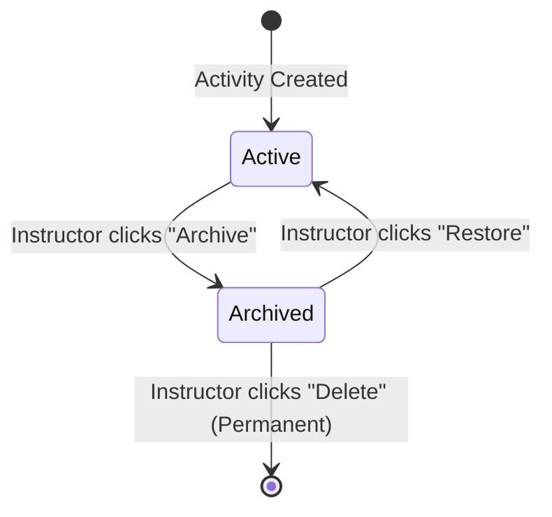
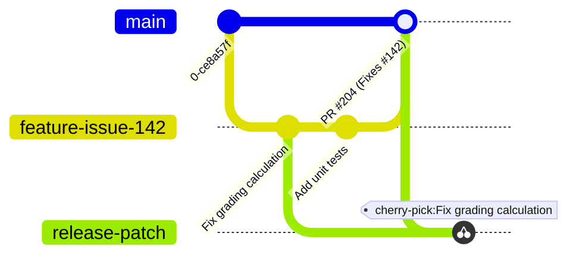

import { Aside, Steps } from '@astrojs/starlight/components';

This guide compiles essential developer tips, core HTTP web concepts, application logic workflows, and version control best practices for engineers contributing to the TeamAssign platform.

---

## Useful Web Dev Concepts

For new software engineers joining the team directly from academic computer science programs, understanding the practical lifecycle of web requests is vital when debugging CGI and `mod_perl` handlers.

### 1. What Happens When You Type a URL Into the Browser
1. **DNS Lookup**: Your browser resolves the domain name (e.g., `dev01.teamassign.org`) to a specific IP address by interrogating Domain Name System (DNS) servers.
2. **TCP & TLS Handshake**: The browser establishes a secure TCP connection over port `443` using TLS/SSL encryption.
3. **HTTP Request**: The browser transmits an HTTP request header asking for the specific path (e.g., `/app/login`).
4. **Server Processing**: Apache intercepts the request, passes it to the `mod_perl` execution engine, and executes `TeamAssign::Dispatcher`. The Perl backend queries PostgreSQL, renders a `Template Toolkit` (`.tt`) HTML template, and returns the response payload back to the browser.

### 2. HTTP Requests and Responses
Every communication between the browser and TeamAssign consists of two parts:

#### HTTP Request Methods & Parameters
- **GET**: Requests data from the server without modifying database state (e.g., viewing a survey results page). Parameters are appended directly to the URL query string (`?survey_id=1042`).
- **POST**: Submits data to the server to create or modify database records (e.g., submitting peer evaluation scores or creating a new team formation activity). Payload data is enclosed inside the request body.
- **Headers**: Metadata transmitted alongside the request, including authentication cookies (`TeamAssignSession`), `User-Agent` strings, and `Content-Type` declarations (`application/x-www-form-urlencoded` or `multipart/form-data`).

#### HTTP Status Codes
When debugging API responses or inspecting `access_log`, familiarize yourself with standard status codes:
- **`200 OK`**: The request succeeded, and the server returned the requested HTML or JSON payload.
- **`302 Found`**: Temporary redirect. Frequently issued after successful form submissions (Post/Redirect/Get pattern) to redirect the browser to a confirmation dashboard.
- **`400 Bad Request`**: Malformed request syntax or missing required form fields.
- **`401 Unauthorized`**: Authentication failure (e.g., expired session cookie or missing OAuth bearer token).
- **`403 Forbidden`**: The user is authenticated but lacks permission to view the resource (e.g., a student attempting to access an instructor-only gradebook URL).
- **`404 Not Found`**: The requested activity, survey, or route does not exist.
- **`500 Internal Server Error`**: Unhandled Perl runtime exception or database query failure. Check `make tail_logs` immediately to view the stack trace.

---

## Navigating TeamAssign Application Logic 🤝

### 1. How to Delete an Activity in TeamAssign
To protect academic data integrity and prevent accidental deletion of critical student evaluation grades, TeamAssign enforces a strict **Two-Step Deletion Lifecycle**:



1. **Archive First**: Active surveys and activities cannot be deleted directly. An instructor must first locate the activity on their dashboard and select **Archive**. This hides the activity from active student views while preserving historical records.
2. **Permanent Deletion**: Once an activity resides inside the **Archived Activities** tab, the instructor can click **Delete** to purge the records permanently from the database.

### 2. TeamAssign’s Mentoring Feature
By default, TeamAssign’s constraint solver enforces a **Strict Unique Team Membership Constraint**: a student user ID can belong to at most *one* team within a given course evaluation activity.

However, many engineering and computer science capstone courses utilize **Upper-Class Mentors** or **Teaching Assistants** who need to evaluate and guide multiple teams simultaneously. To support this without violating relational database foreign keys, our **Mentoring Feature** relaxes the unique constraint:
- When an instructor designates specific users as "Mentors" during survey setup, the backend bypasses standard 1-to-1 team assignment checks.
- Mentors can be assigned across multiple team IDs within the same activity, granting them read/write peer evaluation access across all their assigned student groups.

---

## Working with GitHub & Version Control

We enforce strict Git branching and pull request standards across all repositories (`teamassign/Teamassign-Web` and `teamassign-lib`).



### 1. Creating a Pull Request
- **Protected Master / Main Branch**: Direct pushes to `master` (or `teamassign-web`) are strictly prohibited and blocked by repository branch protections.
- **Feature Branches**: Always branch off the latest `master` before writing code:
  ```bash
  git checkout master
  git pull origin master
  git checkout -b feature/issue-<number>-short-description
  ```
- **Pull Request Submission**: Once tested locally on your dev VM, push your branch and open a Pull Request against `master`. Ensure your PR summary clearly describes the root cause and your testing steps.

### 2. Linking a Pull Request to an Issue
To ensure automatic issue cleanup and clear traceability across our engineering sprint boards, always link your Pull Request to its corresponding GitHub Issue using exact keyword triggers inside the PR description body:
```markdown
Fixes #142
# Or: Closes #142, Resolves #142
```
When the pull request is merged into `master`, GitHub will automatically close the linked issue.

### 3. Duplicating a Commit to Another Branch (`git cherry-pick`)
If you commit a critical bug fix to a feature branch or release branch and need to duplicate that exact commit onto another branch (such as `master` or a hotfix branch) without merging unrelated commits, use `git cherry-pick`:

```bash
# 1. Locate the commit hash of your fix using git log
git log --oneline

# 2. Switch to your target branch (e.g., master or release branch)
git checkout target-branch
git pull origin target-branch

# 3. Cherry-pick the specific commit hash right onto your current branch
git cherry-pick <commit_hash>

# 4. Push the updated target branch to remote
git push origin target-branch
```

### 4. Essential Git Command Reference
When managing complex local changes inside `/var/www/src`, keep these essential cleanup commands in mind:
- **`git status`**: Always run this before staging or committing to verify exactly which files are modified or untracked.
- **`git stash`**: Temporarily shelves uncommitted changes so you can pull updates or switch branches cleanly without losing work. Restore them later using `git stash pop`.
- **`git clean -fd`**: Permanently removes all untracked files (`-f`) and directories (`-d`) from your local working tree. Use with caution to clean out compiled artifacts or temporary logs.
