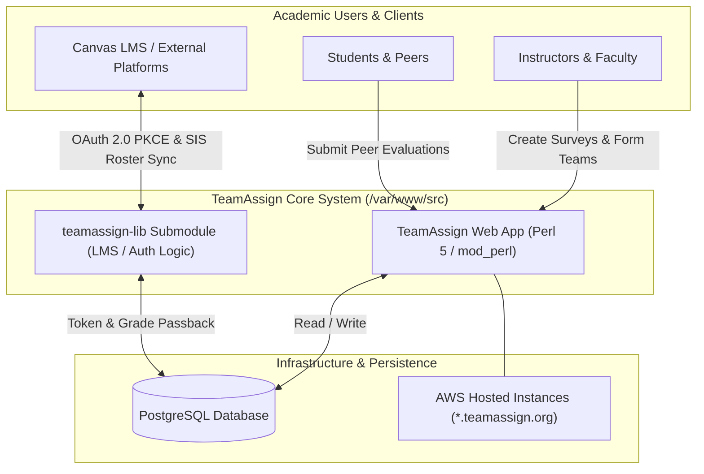

import { Card, CardGrid, Aside } from '@astrojs/starlight/components';

<Aside type="note" title="Author's Institutional Knowledge Note">
This is a sanitized excerpt from a comprehensive onboarding guide I independently researched, tested, and authored over a 2-year period for a legacy Perl monolith with zero prior documentation. It demonstrates my ability to navigate unfamiliar codebases, document complex OAuth 2.0 flows, and build self-service developer resources.
</Aside>

## Welcome to the TeamAssign Development Team

Welcome to the TeamAssign technical development team! This documentation will walk you through the initial setups to get you started and provide the essential information you need to know when joining our engineering team. 

First, you need access to TeamAssign’s GitHub repository (where all the source code of the TeamAssign system is located) and the developer’s virtual machine (this is where you will do your development work) before proceeding. If you don’t have access to them, please contact your supervisor.

<Aside type="caution">
Please note that the information in this onboarding guide is subject to change and needs to be updated periodically due to constant software dependency releases (especially the sections regarding Amazon Web Services and Canvas LMS Integration).
</Aside>

---

## System Purpose & Architecture Overview

TeamAssign is a mature, comprehensive web application designed to facilitate academic team management, peer evaluation, and survey administration. Originally developed at a major research university, the system has been in continuous operation for over 15 years, serving thousands of instructors and hundreds of thousands of students across hundreds of higher education institutions globally.



### Essential Documents for Getting Started
Since TeamAssign is primarily written in **Perl**, new engineers should familiarize themselves with Perl syntax and application structure:
- **Perl Basics**: Recommended online resources include [Learn Perl](https://learn.perl.org) and [Geeks for Geeks Perl tutorials](https://www.geeksforgeeks.org/perl-programming-language/).
- **Product Understanding**: Explore all user-facing features before touching code:
  1. **TeamAssign Info Site**: Check the 'Instructor' and 'Student' sections. Spend more time on the 'Instructor' section since this is where the most complicated algorithms reside. Review the FAQ page for common user questions.
  2. **TeamAssign Help Pages**: Contains detailed walkthroughs with highlighted system screenshots.
  3. **TeamAssign Step-by-Step Instructor's Guide**: Comprehensive guide focusing specifically on instructor workflows.
- **Repository Guidelines**: Inside the primary TeamAssign GitHub repository, consult `CONTRIBUTING.pod` for internal development patterns.

---

## TeamAssign Testing Accounts

During local and remote development, several pre-configured dummy testing accounts are available across our developer virtual machines (`dev01.teamassign.org`, `dev02.teamassign.org`, `dev03.teamassign.org`) and production testing environments.

### 1. Pre-existing Test Credentials
When connecting to development virtual machines (e.g., `https://dev01.teamassign.org/login/index`), you can log in using our standardized faculty and student accounts:
- **Faculty / Instructor Account**: `faculty_test@teamassign.org` (Password: `[REDACTED_TEST_PASS]`)
- **Student Accounts**: `student_test@teamassign.org` (Password: `[REDACTED_TEST_PASS]`)

<Aside type="tip">
**Handling SSL Certificate Expiration (`thisisunsafe`)**: Because development instances (`dev01`, `dev02`, etc.) are internal, their SSL certificates occasionally expire without urgent renewal. When accessing `https://dev01.teamassign.org/login/index` in Google Chrome or Microsoft Edge, you may encounter an `ERR_CERT_DATE_INVALID` warning page. Simply click anywhere on the error window (outside the URL bar) and type `thisisunsafe` directly on your keyboard to bypass the browser security block.
</Aside>

### 2. Creating Custom Test Accounts on Dev Machines
If you do not have access to existing test accounts or need a fresh administrative user for isolated testing, you can generate one directly through the PostgreSQL database:

1. Log into your assigned developer virtual machine (`ssh -A username@<devNum>.teamassign.org`).
2. Navigate to `/var/www/src` where the source code and `Makefile` reside.
3. Generate a secure, hashed password using `TeamAssignAuthLib`:
   ```bash
   perl -I /var/www/src/teamassign-lib/lib/ -MTeamAssignAuthLib -e 'warn smarter_crypt("YourChosenPassword")'
   ```
4. Copy the output hashed value to your clipboard.
5. Enter the interactive database shell by running `make db`.
6. Insert the new account record directly into the `person` table:
   ```sql
   INSERT INTO person (person_type, person_status, first_name, last_name, email, school, password) 
   VALUES ('admin', 'active', 'DevFirstName', 'DevLastName', 'devuser@test.edu', 'Test University', '<hashed_value_from_step_3>');
   ```

---

## Accessibility Compliance & Institutional Mandates

A major engineering focus within TeamAssign is maintaining strict adherence to accessibility standards across all user interfaces.

### Why Accessibility is Critical
Because TeamAssign is deployed across hundreds of higher education institutions receiving federal funding, the platform is legally mandated to comply with **Section 508** of the Rehabilitation Act and **WCAG 2.1 AA** (Web Content Accessibility Guidelines). 

Failure to maintain accessibility standards prevents visually impaired, motor-impaired, and neurodivergent students from completing required course evaluations, leading to institutional compliance violations.

### Key Accessibility Requirements for Developers
When building or modifying HTML templates (`Template Toolkit` `.tt` files or CGI output), engineers must verify:
- **Semantic HTML & ARIA Landmarks**: Ensure screen readers correctly identify navigation menus, main content regions, and form controls.
- **Keyboard Navigation**: All interactive elements (survey matrix buttons, evaluation sliders, team formation drag-and-drop actions) must be fully operable via `Tab`, `Shift+Tab`, `Enter`, and `Space` without requiring mouse input.
- **Color Contrast & Focus Rings**: Never rely purely on color changes to indicate validation errors or active selections. Maintain high-contrast visual focus indicators across all input fields.
