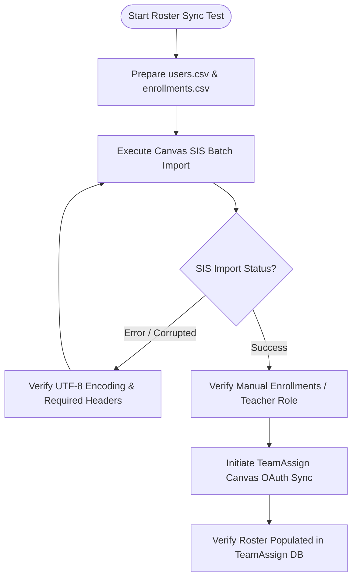

import { Aside, Steps } from '@astrojs/starlight/components';

This runbook outlines standard operational workflows and diagnostic troubleshooting procedures when setting up Canvas LMS testing environments, executing Student Information System (SIS) batch uploads, and validating roster imports into TeamAssign.

---

## Testing Import From Canvas to TeamAssign

When verifying OAuth 2.0 API integrations and student roster synchronization, developers frequently need to populate their Canvas testing instances with standardized course rosters before executing imports into TeamAssign.



---

## How to SIS Import (Batch Upload) Using a CSV File in Canvas

Instead of manually creating dozens of individual student accounts through the Canvas UI when testing large class evaluation algorithms, administrators and developers can execute **SIS Batch Imports** using structured CSV files.

### 1. Preparing the SIS CSV Files
To batch upload a course roster, prepare two required comma-separated values files adhering strictly to Canvas SIS import specs:

#### `users.csv` (Master User Account Records)
Must include exact column headers defining user identities and authentication logins:
```csv
user_id,login_id,password,first_name,last_name,email,status
stu101,student101@test.edu,TestPass123!,Alice,Smith,student101@test.edu,active
stu102,student102@test.edu,TestPass123!,Bob,Jones,student102@test.edu,active
```

#### `enrollments.csv` (Course & Section Association)
Links the `user_id` records directly into your specific Canvas test course (`course_id`) under defined academic roles (`StudentEnrollment` or `TeacherEnrollment`):
```csv
course_id,user_id,role,status
test_course_01,stu101,StudentEnrollment,active
test_course_01,stu102,StudentEnrollment,active
```

### 2. Executing the Batch Upload
<Steps>
1. Log into your Canvas LMS test instance as an administrative user (`https://<canvas_domain>`).
2. In the left hand global navigation menu, select **Admin** and click on your root account (e.g., *Site Admin* or *Test University*).
3. In the sub-navigation menu, click on **SIS Import**.
4. Under **Import via CSV**, click **Choose File** and upload your zipped CSV bundle (or individual `users.csv` / `enrollments.csv` file).
5. Select **Process as UI-Changes** and click **Process Data**.
6. Monitor the **Current and Recent Imports** table below until the job status displays `Completed`.
</Steps>

---

## How to Manually Add People to a Canvas Course

If you only need to enroll a single test student or co-instructor to verify targeted edge cases in TeamAssign’s peer evaluation roster sync:

<Steps>
1. Navigate directly to your specific course window inside Canvas.
2. In the course left navigation bar, select **People**.
3. Click the **+ People** (`Add People`) button in the upper right corner.
4. Select **Add user by Email Address** or **Login ID**, enter the test account credentials (`student_test@teamassign.org`), and select the desired role (**Student**, **Teacher**, or **TA**).
5. Click **Next** and **Add Users**.
</Steps>

<Aside type="caution">
**Pending Invitation States**: When manually adding users, Canvas initially places their enrollment in an `invited` state until the student logs in and accepts the course invitation. TeamAssign’s API roster import (`lib/LMS/Canvas.pm`) filters out unconfirmed invitations by default. Ensure the test user has accepted the course invitation (or use administrative SIS imports with `status=active`) before testing synchronization!
</Aside>

---

## Common SIS & Roster Sync Pitfalls

When debugging roster import issues between Canvas and TeamAssign, check these common operational causes first:

### 1. CSV Encoding & Delimiter Mismatches
- **Symptom**: Canvas rejects the SIS upload with `Invalid CSV file format` or imports garbled character strings.
- **Root Cause**: The spreadsheet editor (Excel/Numbers) saved the file using Mac OS Roman or ANSI encoding instead of UTF-8, or used semicolon `;` delimiters instead of commas `,`.
- **Resolution**: Open the CSV file in a plain text editor to verify comma separation, and re-save explicitly as **CSV UTF-8 (Comma delimited)**.

### 2. Missing Administrative Scopes during OAuth Sync
- **Symptom**: An instructor successfully links Canvas via OAuth 2.0, but clicking **Sync Roster** in TeamAssign returns a `401 Unauthorized` or `403 Forbidden` API error.
- **Root Cause**: The API Client ID configured in Canvas lacks sufficient scopes to query course enrollment lists, or the linking instructor holds a `Teaching Assistant` role with restricted read permissions instead of a `TeacherEnrollment` role.
- **Resolution**: Verify that the instructor holds the primary `Teacher` role across the target Canvas course and that the developer VM's OAuth `client_id` holds active scopes for `url:GET|/api/v1/courses/:course_id/enrollments`.
