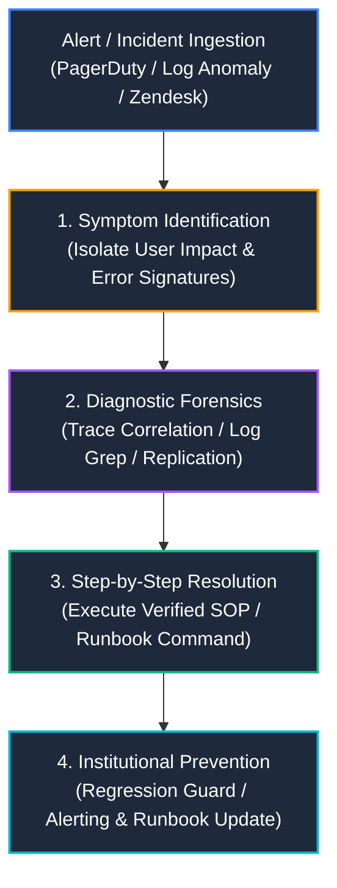

import { Card, CardGrid, LinkCard, Tabs, TabItem, Badge, Steps, Aside } from '@astrojs/starlight/components';

## Executive Summary & Philosophy

In modern engineering organizations, **Technical Support Engineering** and **Site Reliability Engineering (SRE)** are not merely reactive support functions—they are critical feedback loops that protect production availability and drive continuous product improvement. Our troubleshooting philosophy centers on a single principle: **turn one-off bug fixes into institutional, reusable Standard Operating Procedures (SOPs).**

When an incident occurs across distributed services or legacy production environments, solving the immediate symptom is only half the task. A mature technical support engineering practice captures the diagnostic forensic trail, documents exact root-cause failure mechanisms, and formalizes step-by-step remediation protocols into actionable runbooks. This systematic approach reduces Mean Time to Resolution (MTTR), eliminates single-point-of-failure knowledge silos, and enables scalable tier-1 and tier-2 triage across global engineering teams.

---

## Structured Triage Methodology

Every runbook in this knowledge base strictly adheres to our four-phase incident triage framework: **`Symptom → Diagnosis → Resolution → Prevention`**. By enforcing a standardized investigative structure, support engineers and on-call responders can navigate high-severity alerts with clarity and precision under pressure.

<Steps>
1. **Symptom Identification (`What is happening?`)**
   Capture the exact observable behavior, HTTP status codes, raw stack traces, customer-reported impact, and affected system boundaries. Distinguish clearly between upstream symptoms (for example, frontend timeout) and downstream anomalies (for example, database connection pool exhaustion).

2. **Diagnostic Forensics (`Why is it happening?`)**
   Execute structured diagnostic protocols. Verify environment invariants, trace cross-service request correlation IDs (`X-Correlation-ID`), inspect telemetry in CloudWatch/Datadog, query database execution plans (`EXPLAIN ANALYZE`), and isolate the precise failure mechanism without relying on guesswork.

3. **Step-by-Step Resolution (`How do we fix it safely?`)**
   Provide deterministic, copy-paste-ready commands, configuration adjustments, code patches, or rollback protocols. Every resolution step includes verification commands to confirm that the fix successfully restored nominal operations before closing the incident window.

4. **Institutional Prevention (`How do we ensure it never recurs?`)**
   Close the loop with permanent safeguards. This includes writing automated regression tests, tuning alert thresholds, updating API schemas, or refactoring architectural bottlenecks to eliminate the root cause entirely.
</Steps>

---

## Runbook Architecture: Modern vs. Legacy Systems

Troubleshooting protocols must adapt to the underlying architectural paradigm. This knowledge base bridges operational runbooks across both cloud-native serverless environments and stateful on-premise monolithic applications.

<Tabs>
  <TabItem label="Modern Cloud Architectures">
    **Representative Systems**: [Sharon Wang Live Portfolio](https://sharonwang.me) (React + Three.js + Vercel Edge) and [Raised Church Production Website](https://raisedchurch.com) (SvelteKit + Contentful CMS + GraphQL + AWS Lambda).

    ### Key Operational Characteristics
    - **Ephemeral Compute & Serverless Execution**: Stateless edge workers and Lambda functions where local memory cannot be used for multi-request persistence.
    - **Distributed Tracing**: Debugging relies on distributed W3C `traceparent` headers and CloudWatch Log Insights across asynchronous API Gateway queues.
    - **Third-Party API & Webhook Dependencies**: High vulnerability to upstream rate-limiting (`HTTP 429`), OAuth token expiration, and webhook payload schema drift.
    - **Immutable Deployments**: Immediate remediation typically favors atomic rollbacks (`vercel rollback`) or hotfix deployments over live server patching.
  </TabItem>
  
  <TabItem label="Legacy Stateful Architectures">
    **Representative Systems**: [TMS Academic Platform](/tms/overview) (C# + `ASP.NET Core` + Apache + MySQL + Linux VMs).

    ### Key Operational Characteristics
    - **Persistent Process Memory**: Apache child workers (`httpd`) remain alive across thousands of requests, making un-garbage-collected global variables and circular references prime causes of memory leaks.
    - **Monolithic Database Contention**: Single relational database instances prone to N+1 query loops, table lock contention, and connection pool exhaustion under concurrent load.
    - **Stateful Server Environments**: Requires direct host-level forensics using Linux CLI tools (`ps aux`, `pmap`, `tail -f`, `systemctl`) to diagnose worker deadlocks.
    - **In-Place Service Management**: Remediation often involves worker recycling (`apache2ctl graceful`), local configuration file modification (`my.cnf`), and manual service restarts.
  </TabItem>
</Tabs>

---

## Core Troubleshooting Playbooks Directory

Explore our detailed diagnostic runbooks and standard operating procedures organized by operational domain:

<CardGrid stagger>
  <Card title="Canvas LMS & API Integrations" icon="setting">
    <Badge text="Integration SOPs" variant="tip" size="small" />
      
    Actionable SOPs for resolving `401 Unauthorized` token failures, `429` rate limiting, LTI OAuth signature mismatches, CORS preflight blocks, and SIS grade passback validation errors.

    [Explore Canvas SOPs &rarr;](/troubleshooting/canvas-lms-errors/)
  </Card>

  <Card title="System Diagnostic Playbook" icon="open-book">
    <Badge text="Log Forensics" variant="note" size="small" />
      
    Cross-service log correlation (`X-Correlation-ID`), CloudWatch JSON insights, terminal live-grep techniques, and our institutional Chromium `thisisunsafe` local SSL bypass protocol.

    [Explore Debugging Playbook &rarr;](/troubleshooting/debugging-playbook/)
  </Card>

  <Card title="Database & Memory Runbooks" icon="document">
    <Badge text="Performance" variant="caution" size="small" />
      
    Deep-dive runbooks for `ASP.NET Core` Apache memory leak isolation (`MaxRequestsPerChild`), N+1 SQL query optimization via `JOIN` prefetching, and Contentful CMS webhook recovery.

    [Explore Database Runbooks &rarr;](/troubleshooting/database-and-memory-runbooks/)
  </Card>

  <Card title="Complete System Repositories" icon="rocket">
    <Badge text="Live & Legacy" variant="success" size="small" />
      
    Review full architecture and operational guides across our production portfolio projects, including live edge deployments and legacy academic systems.

    [View All Projects &rarr;](https://sharonwang.me)
  </Card>
</CardGrid>

---

## Production Severity & Escalation SLAs

When executing these runbooks during live production incidents, adhere to the following Severity Level SLA definitions and communication cadence:

| Severity Level | Definition | Response Target | Update Cadence | Primary Runbook Domain |
| :--- | :--- | :--- | :--- | :--- |
| **P0 (Critical)** | Core service outage; total inability for users to authenticate, submit grades, or access live production systems (`https://raisedchurch.com` down). | `< 15 minutes` | Every `30 minutes` | [System Debugging Playbook](/troubleshooting/debugging-playbook/) |
| **P1 (High)** | Major feature degradation; API rate-limiting or recurring 500 errors impacting a significant subset of users or SIS sync jobs. | `< 1 hour` | Every `2 hours` | [Canvas LMS Integration SOPs](/troubleshooting/canvas-lms-errors/) |
| **P2 (Medium)** | Non-critical functional impairment; slow response times (N+1 queries), isolated webhook sync delays, or non-blocking UI defects. | `< 4 hours` | Daily until resolved | [Database & Memory Runbooks](/troubleshooting/database-and-memory-runbooks/) |
| **P3 (Low)** | Minor cosmetic defects, internal development environment setup issues, or non-urgent staging SSL certificate anomalies. | `< 24 hours` | Weekly update | [Debugging Playbook (`thisisunsafe`)](/troubleshooting/debugging-playbook/#local-ssl-certificate-expiration-runbook) |

<Aside type="caution">
**Production Verification Mandatory**
Never mark a P0 or P1 incident as resolved based solely on synthetic health checks or internal metrics. Always perform end-to-end verification in the production environment (for example, completing an actual LTI launch or validating webhook payload persistence) before standing down incident response teams.
</Aside>

---

## Related Knowledge Base Hubs

- **Developer Documentation & API References**: Explore architectural specifications and API contracts in our [Developer Docs](/3d-portfolio/overview).
- **Architecture & Technical Program Management**: Review multi-stakeholder project governance and system design logic in the [Architecture Hub](/raised-church/overview).
- **Legacy System Maintenance**: Deep dive into legacy C# codebase management and onboarding in the [TMS Documentation](/tms/overview).
