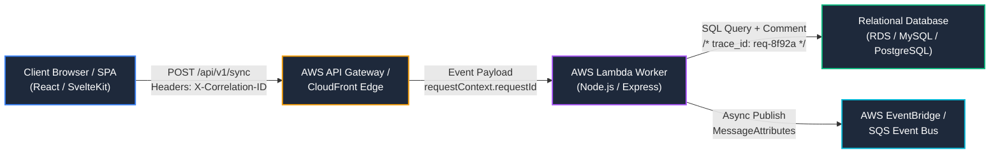

import { Card, CardGrid, Tabs, TabItem, Badge, Steps, Aside } from '@astrojs/starlight/components';

## Systematic Diagnostic Philosophy

When troubleshooting high-severity production anomalies across modern distributed cloud services or stateful staging servers, unstructured trial-and-error costs valuable engineering time. Technical Support Engineers must operate with diagnostic rigor: establishing clear request boundaries, tracing end-to-end telemetry via deterministic correlation identifiers, and isolating root causes from deceptive surface symptoms.

This debugging playbook establishes our foundational diagnostic protocols for **Distributed Log Analysis & Tracing**, alongside an institutional runbook resolving **Chromium Local SSL & HSTS Certificate Expiration Blocks** across staging and local development environments.

---

## Log Tracing & Diagnostic Methodology

Modern microservices architectures split single user interactions into dozens of asynchronous HTTP requests, event bus broadcasts, and database transactions. To diagnose failure paths without manual guesswork, our platform enforces strict distributed request tracking using standardized headers and structured JSON log pipelines.

### Distributed Request Correlation (`X-Correlation-ID`)

Every incoming request entering our API gateways (`https://api.sharonwang.me` or `https://api.raisedchurch.com`) is assigned a globally unique trace identifier injected into the `X-Correlation-ID` (and W3C `traceparent`) header. Every downstream microservice, AWS Lambda worker, and database adapter must extract, propagate, and log this identifier across its execution context.



<Aside type="tip">
**Always Propagate Correlation Headers**
When writing custom HTTP interceptors or background queue workers, never swallow incoming headers. Ensure `X-Correlation-ID` is explicitly passed down into all outgoing `fetch()` or `axios` requests to prevent broken traces during multi-service debugging.
</Aside>

### CloudWatch Log Insights & Structured JSON Logging

To enable rapid query filtering across millions of log streams, our services emit **Structured JSON Telemetry** directly to AWS CloudWatch and local application log files:

```json
{
  "timestamp": "2026-07-22T20:45:12.894Z",
  "level": "ERROR",
  "service": "canvas-sis-sync",
  "correlationId": "req-8f92a4c1-9b3e-4d1a-8c0e-7a2b919e3c11",
  "tenantId": "org_raisedchurch_main",
  "error": {
    "name": "OAuthSignatureException",
    "message": "Timestamp drift exceeded maximum allowable window (300s)",
    "stack": "OAuthSignatureException: Timestamp drift...\n    at verifyLaunch (/var/task/dist/auth.js:142:15)"
  },
  "metadata": {
    "oauth_timestamp": "1721680512",
    "server_timestamp": "1721680980",
    "drift_seconds": 468
  }
}
```

When an alert fires for a failed transaction, execute the following **CloudWatch Log Insights** query syntax across your log groups (`/aws/lambda/canvas-sis-sync-prod`) to reconstruct the full chronological lifecycle of the request:

```text
fields @timestamp, level, service, message, error.message as error_msg, metadata.drift_seconds
| filter correlationId = 'req-8f92a4c1-9b3e-4d1a-8c0e-7a2b919e3c11'
| sort @timestamp asc
| limit 50
```

### Real-Time Terminal Forensics (`tail -f`, `ripgrep`, & `awk`)

When inspecting on-premise staging environments, legacy monolithic servers (such as [TMS](/tms/overview)), or local Docker containers where interactive terminal access is available, use exact streaming shell forensics to isolate exceptions in real time:

<Tabs>
  <TabItem label="Live JSON Stream Parsing (`jq`)">
    Filter a real-time application log stream (`tail -f`) to output only error-level structured log entries with high human readability:
    ```bash
    tail -f /var/log/app/production.log | grep --line-buffered '"level":"ERROR"' | jq -c '{time: .timestamp, id: .correlationId, err: .error.message}'
    ```
  </TabItem>
  <TabItem label="High-Speed Pattern Hunting (`ripgrep`)">
    Use `ripgrep` (`rg`) across rotated log archives to locate all occurrences of a specific `X-Correlation-ID` within milliseconds without reading multi-gigabyte files into memory:
    ```bash
    rg "req-8f92a4c1-9b3e-4d1a-8c0e-7a2b919e3c11" /var/log/app/ --no-heading --line-number
    ```
  </TabItem>
  <TabItem label="Latency Percentile Extraction (`awk`)">
    Extract and calculate the P95 / maximum response times from Apache or Express access logs formatted with response duration ($NF):
    ```bash
    cat /var/log/nginx/access.log | awk '$9 == 500 || $9 == 504 {print $1, $7, $9, "Latency:"$NF"ms"}' | sort -n -k4 -r | head -n 20
    ```
  </TabItem>
</Tabs>

---

## Chromium HSTS/SSL Local Bypass Protocol for Development & Staging Environments

### Background & Security Architecture

During local development (`https://localhost:5173`, `https://local.raisedchurch.com`) and internal staging testing across self-hosted container environments, engineering teams frequently encounter SSL/TLS certificate validation errors:
- `NET::ERR_CERT_AUTHORITY_INVALID`: The certificate authority is self-signed or not recognized by the local OS keychain.
- `NET::ERR_CERT_COMMON_NAME_INVALID`: The Subject Alternative Name (SAN) does not match the exact internal domain.
- `NET::ERR_CERT_DATE_INVALID`: The ephemeral staging SSL certificate has expired.

While modern browsers enforce strict PKI validation to prevent Man-In-The-Middle (MITM) attacks, blocking local development access delays critical QA cycles and integration testing.

### Why Standard Bypass Buttons Disappear Under Strict HSTS

Under normal circumstances, Chromium-based browsers (Chrome, Edge, Arc, Brave) present an advanced warning screen with a **"Proceed to localhost (unsafe)"** button located under the `Advanced` disclosure tab. However, engineers frequently report that this bypass button completely disappears, leaving them deadlocked on a red error screen.

This lockout occurs when the target domain is governed by **HTTP Strict Transport Security (HSTS)**:

```http
Strict-Transport-Security: max-age=31536000; includeSubDomains; preload
```

When an origin sends an HSTS header with `includeSubDomains` (or exists in Chromium's hardcoded global `HSTS Preload List`, such as `*.dev` and `*.app` top-level domains), the browser explicitly **disables all manual user overrides** via UI buttons. Chromium refuses to load any unsecured or self-signed resource on an HSTS-enforced host to guarantee integrity.

### The `thisisunsafe` Keystroke Override Protocol

To safely unblock engineers testing critical local and internal staging endpoints without compromising global browser security settings or disabling OS-level SSL verification, execute our institutional **Chromium HSTS Keystroke Override Protocol**.

<Steps>
1. **Verify Target Environment Scope**
   Confirm that the active URL bar displays a verified internal development address (`localhost`, `127.0.0.1`, `*.local.net`, or an isolated staging instance). **Never execute this protocol on external production domains.**

2. **Focus the Error Background Page**
   When the red or dark gray Chromium SSL error screen appears (`Your connection is not private`), click once anywhere on the **background of the webpage itself** (do *not* click inside the URL address bar or inside any text input box).

3. **Type the Bypass Keystroke Command**
   Directly on your keyboard, type the literal characters (`thisisunsafe`) in sequence without pauses:
   ```text
   t h i s i s u n s a f e
   ```
   *(Note: On certain legacy Chromium builds prior to version 70, the keystroke is `badidea`).* Do not press `Enter` or `Space` after typing.

4. **Automatic Exception Registration**
   Upon typing the final letter (`e`), Chromium immediately intercepts the keystroke sequence, registers a temporary exception in its internal certificate host whitelist for that domain, and automatically reloads the page over the bypassed connection.
</Steps>

<Aside type="danger">
**Strict Security Governance & Scope Limitation**
The `thisisunsafe` keystroke override is an administrative bypass designed strictly for **local development and staging verification**. 
- **NEVER** instruct end-users or customers to execute `thisisunsafe` during external support tickets.
- **NEVER** use this bypass on live production sites (`https://sharonwang.me` or `https://raisedchurch.com`). If a production domain throws an SSL exception, it represents a real certificate expiration or network interception incident that must be escalated immediately to Site Reliability Engineering.
</Aside>

### Managing & Clearing Browser HSTS Policies

If an engineer needs to clear stored local HSTS exceptions or force-reset security policies for an internal testing domain, guide them through Chromium's internal network diagnostic panel:

1. Navigate to the internal network utilities dashboard in Chromium:
   ```text
   chrome://net-internals/#hsts
   ```
2. Scroll to the **`Delete domain security policies`** section.
3. Enter the exact domain name (e.g., `local.raisedchurch.com` or `dev-api.internal`) into the `Domain:` input field and click **Delete**.
4. Clear browser socket pools (`chrome://net-internals/#sockets -> Flush socket pools`) and refresh the testing environment.

---

## Related Knowledge Base References

- **Canvas LMS Diagnostic SOPs**: Review exact remediation protocols for API rate limits and token failures in our [Canvas LMS SOP Directory](/troubleshooting/canvas-lms-errors/).
- **Database & Memory Runbooks**: Explore low-level process debugging and SQL execution plan optimization in our [Database & Memory Runbooks](/troubleshooting/database-and-memory-runbooks/).
- **Production Architecture**: Examine our live edge deployments across the [Raised Church Website](/raised-church/overview) and our interactive [3D Space Portfolio](/3d-portfolio/overview).
